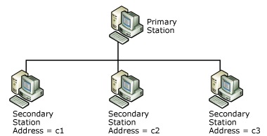
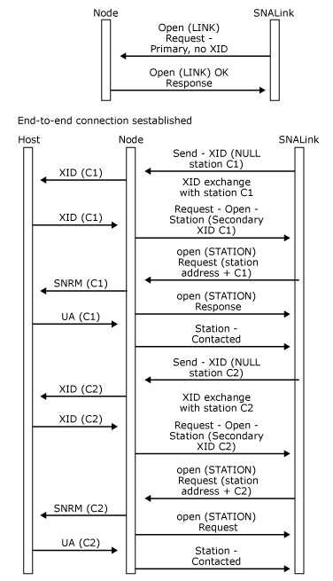
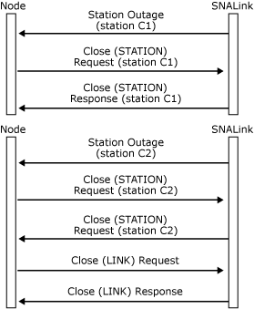

# SDLC Multipoint Connections
The node can support primary multipoint (also known as multi-dropped) links, at both the primary and secondary end. Multipoint is a special configuration for a synchronous data link control (SDLC) leased link where a single SDLC line at the primary station can be used to communicate with up to 16 secondary stations. Special hardware is required to fan out the primary line so that there is a physical connection to each secondary station. The following figure shows an example with three secondary stations.  
  
   
Primary station with three secondary stations  
  
 The SDLC address of the secondary station is used to route frames to and from the individual secondary stations. Hence, the SNALink at the secondary station needs to check the SDLC address as the primary sends all frames to all secondary stations. The SNALink at the secondary station should only accept frames with its SDLC address—the other frames should be ignored.  
  
 From the viewpoint of the node at a secondary station, the message flow at the data link control (DLC) interface is as for a point-to-point connection (described in [Opening a Connection](../core/opening-a-connection-snadis-1.md)). The node need have no knowledge that this is a multipoint connection.  
  
 The primary end has to handle the special processing required for multipoint connections. The remainder of this section concentrates on the primary station.  
  
 At the primary end, there are the following LPI connections:  
  
- One LINK LPI connection.  
  
- A STATION LPI connection for each active secondary station.  
  
  Because the exchange identification (XID) exchange is carried out using the single LINK LPI connection, the [Request-Open-Station](./request-open-station2.md) and [Send-XID](./send-xid1.md) messages always specify the station address of the secondary station that the XID has arrived from or is going to. Note that no XID is supplied on the [Open(LINK) Request](./open-link-request1.md).  
  
  Each STATION LPI connection has different values of I, the index. After the station has been activated, data messages flow on the STATION LPI connection rather than the LINK LPI connection.  
  
  If the XID exchange fails because the secondary is failing to reply to the XID, the SNALink generates a special variant of link [Outage](./outage2.md) message. Ideally, the SNALink would give a station Outage message, but this is not possible because the STATION LPI connection is not yet open. Instead, the SNALink generates a link Outage message with code 0xA0 and a subqualifier that is the SDLC address of the station.  
  
  When the stations are activated on a multipoint link, the majority of messages flow across the STATION LPI connections. If a connection to a particular secondary station is to be closed (because the operator deactivates it, for instance), the node issues a [Close(STATION) Request](./close-station-request2.md). The SNALink replies with a [Close(STATION) Response](./close-station-response1.md) to the node and sends a Discontact (DISC) frame to the secondary station.  
  
  The SNALink can generate both station and link Outage messages. If the problem only affects a particular station, such as not responding to polls, the link generates a station Outage message and the node closes the station with a **Close(STATION) Request**. The SNALink responds with a **Close(STATION) Response**.  
  
  If the problem affects the link as a whole, such as the line being disconnected from the primary SDLC adapter, the SNALink generates a link Outage message and the node sends a [Close(LINK) Request](./close-link-request1.md). The SNALink responds with a [Close(LINK) Response](./close-link-response2.md).  
  
  Whenever the node receives a **Close(STATION) Response**, it checks to see if any stations are still active on the multipoint link. If not, a **Close(LINK) Request** is sent. The SNALink responds with a **Close(LINK) Response**. The following figure shows the message flows for outage processing. It shows a multipoint connection with two secondary stations (the full XID exchange is not shown).  
  
    
  Message flow for outage processing  
  
    
  Processing for a multipoint configuration with two secondary stations  
  
  Note that the station messages are labeled in the figure with station addresses. In fact, the node and SNALink use the LPI addresses to identify the two stations.