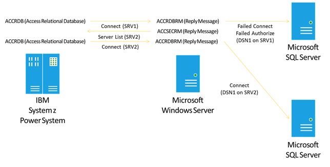

# Service for DRDA (Operations)

The following sections provide help for operating Microsoft Service for DRDA (DRDA Service).

## Managing DRDA Service

### Starting DRDA Service

You can start the DRDA Service to run as a service or console application.

### Windows Service

Using a Command Window, you can start the DRDA Service to run as a service, under credentials defined in the service configuration. Open a command prompt, enter net start msdrdaservice and select Enter.

```
C:\Windows\system32>net start msdrdaservice
The Microsoft Service for DRDA service is starting.
The Microsoft Service for DRDA service was started successfully.
```

### Console Application

Using a Command Window, you can run the DRDA Service to run as a console application, under the credentials of the command window.

1. From a command prompt, enter **net stop msdrdaservice** and press Enter.

```
C:\Program Files (x86)\Microsoft Visual Studio\2019\Professional\VC>net stop msdrdaservice
The Microsoft Service for DRDA service is stopping.
The Microsoft Service for DRDA service was stopped successfully.
```

2. From a command prompt, enter **msdrdaservice.exe -c** and press Enter.

```
Information:0:3:[Jan 24 2024 17:03:15.743] disableXaTransaction has been set to False by parsing string: False
Information:0:3:[Jan 24 2024 17:03:15.743] Successful to set TransactionExpiryDuration.
Information:0:3:[Jan 24 2024 17:03:15.743] Successful to set ResyncRetryDurationInMinutes.
Information:0:3:[Jan 24 2024 17:03:15.743] Successful to set XaIsolationLevel attribute to: SZ
Information:0:3:[Jan 24 2024 17:03:15.743] ResynchronizationManager reaching the end of transaction log file.
Information:0:5:[Jan 24 2024 17:03:15.962] Enter SessionManager::Initialize
Information:0:5:[Jan 24 2024 17:03:16.118] Exit SessionManager::Initialize
Information:0:5:[Jan 24 2024 17:03:16.118] Enter TcpConnectionManager::StartListener
Information:0:3:[Jan 24 2024 17:03:16.118] Microsoft Service for DRDA (build: 11.0.2205.0)
Information:0:3:[Jan 24 2024 17:03:16.118] TCP communication manager listening on port 446
Information:0:5:[Jan 24 2024 17:03:16.150] Exit TcpConnectionManager::StartListener
Information:0:5:[Jan 24 2024 17:03:16.150] Exit TcpConnectionManager::Initialize
Information:0:4:[Jan 24 2024 17:03:16.150] Set ServerBootstrap state to: Started
```

> [!NOTE]
> The DRDA Service trace listener will output information to the console window. You need to uncomment the DrdaAsConsoleListener entry and set a traceLevel (i.e 5) in the MsDrdaServiceConfig.exe.config file.

### Stopping DRDA Service

You can stop the DRDA Service when it is running as a service or console application.

#### Windows Service

Using a Command Window, you can stop the DRDA Service when running as a service.

1. From the command prompt, enter net stop msdrdaservice and press Enter.

```
C:\Windows\system32>net stop msdrdaservice
The Microsoft Service for DRDA service is stopping.
The Microsoft Service for DRDA service was stopped successfully.
```

#### Console Application

Using a Command Window, you can stop the DRDA Service when it is running as a console application.

- From the command prompt, type CTRL+C.

```
C:\Windows\system32>
```

> [!NOTE]
> The DRDA Service stops running as a console application, and the command prompt appears.

## Connecting DRDA Clients to SQL Server Databases

The DRDA Service processes DRDA client requests into connections to local and remote SQL Server databases. This topic discusses the operation of the MsDrdaService database connection operations.

### Client Connections

At service startup, the DRDA Service will write an informational entry to the internal DRDA Service trace listeners, notifying the IT professional of the port on which the TCP Communication Manager is listening for in-bound DRDA application requester client connections.

```
Information:0:3:[Jan 24 2024 17:03:16.118] TCP communication manager listening on port 446
```

 Remote DRDA application requester clients connect to the local DRDA Service via a TCP/IP network connection. The DRDA client sends DRDA EXCSAT (Exchange Server Attributes), ACCSEC (Access Security), and ACCRDB (Access Relational Database) protocol flows and data formats, to which the DRDA Service responds with DRDA protocol replies.

## Authentication

To provide integrated authentication, the DRDA Service can combine in-bound credential validation and mapping using Microsoft Enterprise Single Sign-On (ESSO), with out-bound SQL Server authentication using Windows SSPI (Security Support Provider Interface). For example, the DRDA Service can work with ESSO to map an IBM RACF (Resource Access Control Facility) username and password to a Microsoft Windows Active Directory domain\username, with which to connect with integrated security to a remote SQL Server database.

## SQL Server Connections

The DRDA Service communicates to upstream local or remote SQL Server databases using the ADO.NET Framework Provider for SQL Server. The underlying SQL Client access SQL Server via an in-memory connection, or across a network using either Named Pipes or TCP/IP. The SQL Client supports optional encryption and failover features to improve security and reliability. The DRDA Service supports optional single sign-on and pooling features to improve security and performance. You can edit the MsDrdaService.exe.config file to instruct the DRDA Service on how to manage the SQL client to SQL Server connections.

## Failover Connections
The DRDA Service can operate in groups of two (2) servers, one per computer, to provide basic fault tolerance. When a DRDA AR client connects to a SQL Server database, the DRDA Service returns a DRDA SRVLST (Server List) with a weighted list of Data Server instances. In case of failover of a primary DRDA Service, the DRDA AR can use this information to connect to the alternate member of a pair of DRDA Service computers. Combined with SQL Server clustering or mirroring, this technology can offer a reasonable level of fault tolerant failover protection.



The previous illustrations shows how DRDA clients can re-connect to DRDA Service partner server in failover scenarios.

## Processing Package Binds

The DRDA Service will convert static SQL for DB2 packages into SQL Server stored procedures, by processing DRDA Begin Bind (BGNBND) and Bind SQL Statement (BNDSQLSTT) commands into SQL Server DROP PROCEDURE and CREATE PROCEDURE statements. A DRDA BGNBND flow will contain one or more BNDSQLSTT flows, one per SQL statement stored within the package. The DRDA Service maps one DRDA static SQL package section (with one statement) to one SQL Server stored procedure. The DRDA Service maps or preserves the BGNBND package bind options in comments within the stored procedures, and optional extended stored procedure properties. The DRDA Service uses an internal SQL transformer to convert SQL command syntax, parameters, data types, cursors, and results sets. Optionally, you can develop a custom package bind listener to process the packages interactively with the DRDA Service or off-line.

### Bind Package to XML File

The DRDA Service can process a single BGNBND flow into a static SQL for DB2 package XML file, preserving the original bind options and statements as defined by the DRDA BNDSQLSTT flows.

### Bind Package to Stored Procedure

The DRDA Service will process a single BGNBND flow into a SQL Server stored procedure, transforming the original statements as defined by the DRDA BNDSQLSTT flows into corresponding SQL Server syntax.

#### Create Procedure Statement

The DRDA Service internal package bind listener and most custom listeners will include an IF EXISTS clause with DROP PROCEDURE statement, depending on the value of the PKGRPLOPT (Package Replacement Option) in the BGNBND (Begin Bind) DRDA protocol flow. The default value for PKGRPLOPT is PKGRPLALW (Package Replacement Allowed). Optionally, the value PKGRPLNA (Package Replacement Not Allowed) can be specified.

The DRDA Service internal package bind listener and most custom listeners will include comments just prior to the CREATE PROCEDURE statement text, which inform the DRDA Service runtime how to execute the stored procedures.

#### Query Resultset

This comment instructs the DRDA Service to use a SqlClient DataReader to return the results of the SELECT statement.

```
/****** RETURN RESULTSET ******/
```

#### Query Output Parameters

This comment instructs the DRDA Service to prepare OUTPUT parameters when calling the procedure with which to return the data from the query.

```
/****** HAS OUTPUT PARAMS ******/
```

#### Cursor with Hold

This comment instructs the DRDA Service to hold cursors open within a transaction.

```
/****** CURSOR WITH HOLD ******/
```

#### Bind Options

This comment preserves the runtime DRDA BNDOPT (Bind Options) for future use.

```
/****** BNDOPT: <Options><BNDCHKEXS>BNDEXSOPT</BNDCHKEXS><BNDCRTCTL>BNDNERALW</BNDCRTCTL><BNDEXPOPT>EXPNON</BNDEXPOPT><DFTRDBCOL>DBO</DFTRDBCOL><DGRIOPRL>1</DGRIOPRL><PKGATHOPT>PKGATHKP</PKGATHOPT><PKGATHRUL>OWNER</PKGATHRUL><PKGISOLVL>ISOLVLCS</PKGISOLVL><PKGOWNID>PLARSEN</PKGOWNID><PKGRPLOPT>PKGRPLALW</PKGRPLOPT><QRYBLKCTL>LMTBLKPRC</QRYBLKCTL><RDBRLSOPT>RDBRLSCMM</RDBRLSOPT><STTDATFMT>ISODATFMT</STTDATFMT><STTDECDEL>DECDELPRD</STTDECDEL><STTSTRDEL>STRDELAP</STTSTRDEL><STTTIMFMT>ISOTIMFMT</STTTIMFMT></Options> ******/
```

### Ignore Bind and Execute Package Commands

DRDA Client programs will bind a set of standard packages that contain basic DECLARE CURSOR statements, with which to define how to fetch and return results on SELECT and CALL statements against IBM DB2 for z/OS. The DRDA Server does not need to convert these packages into SQL Server stored procedures. You can save bind processing and storage space by instructing the DRDA Server to ignore these packages, by reading a IgnoreStandardPackages.txt file containing a delimited list of qualified package name values.

```
COLIDPKGNAM
SYSIBM*
*MSCS001
*MSUR001
*MSRS001
*MSRR001
*MSNC001
NULLIDSYSSH*
```

Contents of stock IgnoreStandardPackages.txt file.

The first row of the file contains a tab-delimited set of two values that represent column headers. The first column header is the COLID (Collection Identifier). The second column header is the PKGNAM (Package Name). The remaining rows of the file contain a set of tab-delimited values for collection identifier and package name.

An asterisk in place of a value denotes any value. The Microsoft DRDA Client offers a set of tools for defining the standard set of packages in one or more user-defined collections. In this case, the wildcard instructs the DRDA Server to ignore bind and execution commands referencing the Microsoft DRDA Client standard packages, no matter in which collection the packages are defined.

An asterisk at the end of a string denotes a partial value. The IBM DB2 Connect DRDA Client offers a set of tools for defining the standard set of packages in a NULLID collection with a starting package name value of SYSSH. In this case, the wildcard instructs the DRDA Server to ignore bind and execution commands referencing the full set of IBM DB2 Connect DRDA Client standard packages.

## Data Types

The DRDA Service provides compatibility across heterogeneous vendor products and technologies, by providing these platform conversions.

## DB2 to SQL Server Data Type Mappings

The DRDA Service maps DB2 to SQL Server data types based on a defined set of mappings stored in a Db2ToSql.xml file in the %DRDAROOT%\system directory. For example, the DRDA Service converts DB2 TIMESTAMP values and formats as defined in DRDA protocol flows and formatted data into SQL Server DATETIME2(6) values and formats as defined in stored procedures and dynamic SQL statements through the Microsoft ADO.NET Framework Data Provider for SQL Server interfaces.

|Source DB2 Type|Target SQL Server Type|
|---------------------|----------------------------|
|TIME|TIME|
|TIMESTAMP|DATETIME2|
|DATE|DATETIME|
|CHAR|CHAR|
|CHAR () FOR BIT DATA|BINARY|
|CHAR () FOR MIXED DATA|NCHAR|
|CHAR () FOR SBCS DATA|CHAR|
|CHARACTER|CHAR|
|CHARACTER () FOR BIT DATA|BINARY|
|FIXEDBYTE|BINARY|
|CHARACTER () FOR MIXED DATA|NCHAR|
|CHARACTER () FOR SBCS DATA|CHAR|
|NATIONAL CHARACTER|NCHAR|
|VARCHAR|VARCHAR|
|VARCHAR () FOR BIT DATA|VARBINARY|
|VARBYTE|VARBINARY|
|VARCHAR () FOR MIXED DATA|NVARCHAR|
|VARCHAR () FOR SBCS DATA|VARCHAR|
|CHARACTER VARYING|VARCHAR|
|CHARACTER VARYING () FOR BIT DATA|VARBINARY|
|CHARACTER VARYING () FOR MIXED DATA|NVARCHAR|
|CHARACTER VARYING () FOR SBCS DATA|VARCHAR|
|NATIONAL CHARACTER VARYING|NVARCHAR|
|LONG VARCHAR FOR BIT DATA|IMAGE|
|LONG VARCHAR|TEXT|
|GRAPHIC|NCHAR|
|VARGRAPHIC|NVARCHAR|
|GRAPHIC VARYING|NVARCHAR|
|SMALLINT|SMALLINT|
|INT|INT|
|INTEGER|INT|
|BIGINT|BIGINT|
|DECIMAL|DECIMAL|
|NUMERIC|DECIMAL|
|REAL|REAL|
|FLOAT|FLOAT|
|DOUBLE|FLOAT|
|DOUBLE PRECISION|FLOAT|
|BLOB|IMAGE|
|BINARY LARGE OBJECT|IMAGE|
|CLOB|TEXT|
|CLOB () FOR MIXED DATA|NTEXT|
|CLOB () FOR SBCS DATA|TEXT|
|CHAR LARGE OBJECT|TEXT|
|CHAR LARGE OBJECT () FOR MIXED DATA|NTEXT|
|CHAR LARGE OBJECT () FOR SBCS DATA|TEXT|
|CHARACTER LARGE OBJECT|TEXT|
|CHARACTER LARGE OBJECT () FOR MIXED DATA|NTEXT|
|CHARACTER LARGE OBJECT () FOR SBCS DATA|TEXT|

## SQL Server to DB2 Data Type Mappings
 The DRDA Service maps DB2 to SQL Server data types based on a defined set of mappings stored in a MsSqlToDb2.xml file in the %DRDAROOT%\system directory. For example, the DRDA Service converts SQL Server MONEY values and formats as defined by the Microsoft ADO.NET Framework Data Provider for SQL Server interfaces into DB2 DECIMAL values and formats as defined in DRDA protocol flows and formatted data.

|Target SQL Server Type|Source DB2 Type|
|----------------------------|---------------------|
|SMALLINT|SMALLINT|
|INT|INTEGER|
|REAL|REAL|
|FLOAT|DOUBLE|
|SMALLMONEY|DECIMAL(10,4)|
|MONEY|DECIMAL(19,4)|
|BIT|SMALLINT|
|TINYINT|SMALLINT|
|BIGINT|BIGINT|
|UNIQUEIDENTIFIER|CHAR(38)|
|VARBINARY|VARBYTE|
|TIMESTAMP|TIMESTAMP|
|BINARY|FIXEDBYTE|
|XML|LONG VARCHAR|
|IMAGE|LONG VARCHAR|
|VARIANT|VARCHAR(32672) FOR BIT DATA|
|TEXT|LONG VARCHAR|
|CHAR|CHAR|
|VARCHAR|VARCHAR|
|NCHAR|CHAR|
|NVARCHAR|VARCHAR|
|NTEXT|LONG VARCHAR|
|DECIMAL|DECIMAL|
|NUMERIC|DECIMAL|
|DATETIME|TIMESTAMP|
|DATETIMEOFFSET|TIMESTAMP|
|DATE|DATE|
|TIME|TIME|
|SMALLDATETIME|TIMESTAMP|
|SYSNAME|VARGRAPHIC(128)|

## Configuring Data Type Mappings

The DRDA Service converts base data types from DB2 to SQL Server, and from SQL Server to DB2. Optionally, you can edit these XML files to modify the base data type mappings.

```
C:\Program Files\Microsoft Service for DRDA\system\ DB2ToMSSql.xml
C:\Program Files\Microsoft Service for DRDA\system\ MSSQLToDB2.xml
```

## Locale Encoding

The DRDA Service supports locale-specific string encodings.

## EBCDIC

The DRDA Service supports the below-listed SBCS (Single Byte Character Set) EBCDIC CCSIDs converted to and from UNICODE 1208.

|Name|CCSID|NLS Code Page|
|----------|-----------|-------------------|
|EBCDIC - Arabic|420|20420|
|EBCDIC - Cyrillic (Russian)|880|20880|
|EBCDIC - Cyrillic (Serbian, Bulgarian)|1025|21025|
|EBCDIC - Denmark/ Norway (Euro)|277|1142|
|EBCDIC - Denmark/ Norway|277|20277|
|EBCDIC - Finland/ Sweden (Euro)|278|1143|
|EBCDIC - Finland/ Sweden|278|20278|
|EBCDIC - France (Euro)|297|1147|
|EBCDIC - France|297|20297|
|EBCDIC - Germany (Euro)|273|1141|
|EBCDIC - Germany|273|20273|
|EBCDIC - Greek (Modern)|875|875|
|EBCDIC - Greek|423|20423|
|EBCDIC - Hebrew|424|20424|
|EBCDIC - Icelandic (Euro)|871|1149|
|EBCDIC - Icelandic|871|20871|
|EBCDIC - International (Euro)|500|1148|
|EBCDIC - International|500|500|
|EBCDIC - Italy (Euro)|280|1144|
|EBCDIC - Italy|280|20280|
|EBCDIC - Latin America/Spain (Euro)|284|1145|
|EBCDIC - Latin America/Spain|284|20284|
|EBCDIC - Multilingual/ ROECE (Latin-2)|870|870|
|EBCDIC - Thai|838|20838|
|EBCDIC - Turkish (Latin-3)|905|20905|
|EBCDIC - Turkish (Latin-5)|1026|1026|
|EBCDIC - U.S./ Canada (Euro)|37|1140|
|EBCDIC - U.S./ Canada|37|37|
|EBCDIC - United Kingdom (Euro)|285|1146|
|EBCDIC - United Kingdom|285|20285|

## ANSI
 The DRDA Service supports the below-listed SBCS (Single Byte Character Set) ANSI CCSIDs converted to and from UNICODE 1208.

|Name|CCSID|NLS Code Page|
|----------|-----------|-------------------|
|ANSI - Arabic|1256|1256|
|ANSI - Baltic|1257|1257|
|ANSI - Central Europe|1250|1250|
|ANSI - Cyrillic|1251|1251|
|ANSI - Greek|1253|1253|
|ANSI - Hebrew|1255|1255|
|ANSI - Latin I|1252|1252|
|ANSI - Turkish|1254|1254|
|ANSI - Arabic|1256|1256|

## Performance

This topic contains information that will help you maximize performance when you are using the DRDA Service.

### Authentication and Encryption

#### Authentication

The DRDA Service utilizes Microsoft Enterprise Single Sign-On for authenticating in-bound DRDA Application Requester (For Example, DB2 for z/OS RACF user identifier and password) user credentials to out-bound SQL Client to SQL Server database connection (For Example, Integrated Security with Windows Active Directory accounts) user credentials. As an alternative to ESSO, you can configure the MsDrdaService to use mapped authentication. The mappedAuthenticationDomain attribute of the MsDrdaService.exe.config instructs the DRDA Service to which Microsoft Windows Active Directory domain to map the in-bound DRDA client credentials (user name and password), when connecting to SQL Server configured for Windows authentication using integrated Security Support Provider Interface (SSPI), but not when using Microsoft Enterprise Single Sign-On. The DRDA Service will cache the security token obtained from Microsoft Enterprise Single Sign-On and Mapped Authentication Domain features for a configured duration of time, with which to use when connecting to SQL Server configured for Windows authentication using integrated Security Support Provider Interface (SSPI).The securityTokenTimeout attribute instructs the DRDA Server to retain a security token for a duration of time, after which to obtain a new Windows Client Identifier (CID). This optional attribute accepts a duration value. The default value is PT8H (Period of Time is 8 hours).To improve performance, you can adjust the ESSO Security Token Timeout value for a longer duration.

#### Encryption

The DRDA Service supports the Data Provider supports authentication and data encryption using Data Encryption Standard (DES) technologies, Secure Sockets Layer (SSL) V3.0, and Transport Layer Security (TLS) V1.0. Also, the DRDA Service supports data encryption only using Advanced Encryption Standard (AES) encryption. These encryption mechanisms may impact performance.

### Connection

**SQL Server Connection**

The Service for DRDA connects to a SQL Server database using the ADO.NET Framework Data Provider for SQL Server and underlying SQL network client. When connecting to a local SQL Server instance, specify the Network Library=dbmslpcn to instruct the SQL Client to connect to SQL Server using shared memory rather than a TCP/IP network connection.To reduce connection start-up time, use SQL Server connection pooling, by setting Pooling=true in the connection string to instruct the SQL Client to add newly created connections to the pool when closed by the DRDA Service. To adjust the impact to the local server, set the Max Pool Size in the connection string to define the maximum number of connections the SQL Client should retain in the connection pool. The default value is 100.To further reduce connection start-up time, use the MsDrdaService internal connection pool, mapping in-bound DRDA AR client connections and authentication credentials to out-bound SQL Server database connections and credentials, by setting a connectionCacheSize attribute to define the number of SQL Client to SQL Server computer connections the DRDA Service will cache in the SQL Client Connection Pool. This optional attribute accepts an integer value. The default value is 1000.The connectionCacheTimeout attribute instructs the DRDA Server to retain a pooled connection for a duration of time, after which to obtain a new SQL client connection. This optional attribute accepts a duration value. The default value is PT8H (period of time is 8 hours).

**Connection Failover**

The DRDA Service can operate within a group to provide fault tolerant failover. The group is defined by specifying a local service role (primary or secondary), available failover partner servers, and a ping interval for monitoring the health of servers within a group. The pingInterval attribute instructs the DRDA Service how frequently to monitor the health of partner server computers, by executing an EXCSAT (Exchange Server Attribute) flow and checking for an EXCSATRD (EXCSAT Reply Data). This optional attribute accepts an integer value. The default value is 10000 milliseconds (10 seconds).

### Platform compatibility

#### Package Procedure Cache

The DRDA Service will process DRDA EXCSQLSTT (Execute SQL Statement) and OPNQRY (Open Query) commands by executing a SQL Server CALL statement against a corresponding SQL Server stored procedure. Prior to executing the CALL statement, the DRDA Service will fetch metadata for the SQL Server stored procedure with which to verify the statement type (SELECT, INSERT, UPDATE, DELETE), cursor type (WITH HOLD), parameter data types (For Example,  CHAR FOR BIT), and other attributes (For example, has results). After fetching the metadata, the DRDA Service will cache this information, including the mapped procedure name, for a configured interval in a package procedure cache in order to improve performance when next executing this package section. The packageProcedureCacheFlush attribute instructs the DRDA Server to flush the package procedure cache after a specified interval of time. This optional attribute accepts a duration value. The default value is P1D (Period of Time is 1 Day).The packageProcedureLastInvoke attribute instructs the DRDA Server to write the names of objects in the package procedure cache to a text file, %DRDAROOT%\LastInvokePackageProcedures.txt, after a specified interval of time. This optional attribute accepts a duration value. The default value is P7D (Period of Time is 7 Days). At service startup, the DRDA Service will load this text file to pre-fetch schema for procedures listed in the file.To improve performance of service startup, you can edit this file and remove unneeded stored procedure names. To disable the reading and writing of the LastInvokePackageProcedures.txt file, set the timespan to PT0S (Period of Time Zero Seconds).

#### SQL Syntax

The DRDA Service has a limited DB2 ANSI to SQL Server T-SQL command syntax transformer that it utilizes for binding packages, executing static and dynamic SQL statements. Optionally, the DRDA Service offers additional compatible DB2 functions in the form of SQL Server CLR-based functions. To improve performance of SQL syntax transformations, enable the DRDA Service CLR-based functions. The DRDA Service transforms static SQL for DB2 packages into SQL Server stored procedures, when processing DRDA begin bind and bind SQL statements commands, including embedded SQL DECLARE CURSOR statements. To improve performance, the DRDA Service returns multiple rows per fetch when possible, unless the package or cursor is defined for single row fetch to support concurrent updating. When defining SELECT statements for optimal read performance, the developer should include a FOR FETCH ONLY or FOR READ ONLY clause.

#### Isolation Level

The DRDA Service maps the IBM DB2 isolation level in the DRDA EXCSQLSTT (Execute SQL Statement) to the SQL Server transaction level on the ADO.NET Provider for SQL Server transaction object. To improve performance and reduce contention on database objects, the developer should utilize DB2 isolation level Cursor Stability (CS) that maps to SQL Server isolation level Read Committed.

#### Date Time Formats and Conversions

The DRDA Service will format string literal date time values from source and into target formats when processing dynamic and static SQL statements, for specific date time and character data types. The conversionFormats element contains dateMasks, timeMasks, and dateTimeMasks for converting to and from DB2 and SQL Server datetime formats, and instructs the DRDA Service when to perform these transformations. The parsing, encoding and decoding of strings to and from date time formatted values will consume additional DRDA Service resources.

#### Code Page Conversions

The DRDA Service maps code pages and supports custom code page conversions using an underlying HIS Encoder component and the Windows National Language Support (NLS) system components. Optionally, the DRDA Service can convert individual code points to support custom code pages. The DRDA Server will consume additional resources when supporting custom code page conversion.

#### Collation Mappings

SQL Server may collate query results in a different order than what is expected by the DRDA client program. For example, an IT professional may configure a SQL Server database to use an ANSI collation and a DB2 for z/OS database to use EBCDIC collation. The DRDA Service can transform a SELECT statement from DB2 ORDER BY COLLATION_KEY (collation-name) syntax to SQL Server T-SQL ORDER BY COLLATE (collation_name) syntax, mapping from a DB2 collation-name value to a SQL Server collation_name value, to provide more compatible query results.The DRDA Service can add a COLLATE clause to an ORDER BY clause, based on a default ORDER BY collation name. The DRDA Service parsing and replacing or adding of SQL syntax will consume additional resources.

### Tracing

The DRDA Service supports a set of shared listeners to log information to text, console, event log, and custom component. The system.diagnostics element of the hostIntegration.drdaAs.drdaService section of the MsDrdaService.exe.config file defines and controls the various listeners.The traceLevel attribute instructs the DRDA Service to trace defined collections of information, from a minimum to a maximum level of tracing. This optional attribute accepts an integer value. The default value is 0, which disables tracing.The DRDA Service can flush trace data automatically to the trace listeners, which ensures the trace data is captured but will increase disk I/O and reduce overall system performance. To improve performance, set autoFlush=false, to disable automatic trace flush.

### Performance Monitor

To measure performance, the DRDA Service offers performance counters. The DRDA Service performance counters capture information about open connections, open statements, packets and bytes sent/received, average processing time, command executions, data fetches, and transaction commits/rollbacks.

#### Configuration

To measure performance, the DRDA Service offers performance counters for use with Windows Performance Monitor. The peformanceCountersOn attribute instructs the DRDA Service to collect information into performance counters. This optional attribute accepts a Boolean value. The default value is false. For more information, see section on Performance. Also, for more information on Windows Performance Monitor, see Performance Counters ([https://go.microsoft.com/fwlink/?LinkID=119211](/windows/win32/perfctrs/performance-counters-portal)).

#### Counters

The DRDA Service outputs data to these Performance Monitor Counters.

1.  Active Sessions

2.  Active SQL Connections

3.  Active Transactions

4.  Bytes Received

5.  Bytes Received/sec

6.  Bytes Sent

7.  Bytes Sent/sec

8.  Transactions

9. Transactions Commits

10. Transactions Commits/sec

11. Transactions RollBacks

12. Transactions/sec

#### DRDA Service Instances

The DRDA Service offers Performance Monitor Counters on a per-service or per-connection “instance” basis, where an “instance” can be a process or session.
