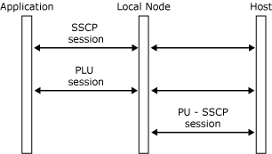
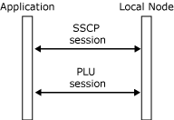

# Sessions and Connections
An application using the function management interface (FMI) can communicate with the host on two SNA sessions as described in the following list:  
  
- The system services control point (SSCP) session, between an SNA server logical unit (LU) and the host SSCP, provides information about the activation of the LU and supports communication with the SSCP for commands such as character-coded and field-formatted logon and logoff commands. There is one SSCP session for each SNA server LU.  
  
- The primary logical unit (PLU) session, between an SNA server LU and the host PLU, is the main session for data transfer between the local application and the host application. There is one PLU session for each SNA server LU.  
  
  The local node communicates directly with the host on the physical unit (PU)-SSCP session:  
  
- The PU-SSCP session, between the PU (local node) and the host SSCP, supports the reporting of alert information and link statistics to the host SSCP.  
  
  The following figure shows the three sessions.  
  
    
  Three sessions  
  
  The application can communicate with the local node by means of two locality, partner, index (LPI) sessions. Rather than specifying the session on which a message is to flow, the application sends the message to the local node on one of these connections. The local node then routes it to the appropriate SNA session.  
  
  The connections are used as follows:  
  
- The SSCP session is used for the initial startup and logon information for a 3270 session. The Host Integration Server 3270 emulation programs also send network management information, such as user alerts and Response Time Monitor (RTM) statistics, to the local node on this session. For more information about this connection, see [SSCP Connection](../core/sscp-connection1.md).  
  
- The PLU session is used for the transfer of application data, and for status and flow control messages between the application and the local node. For more information about this connection, see [PLU Connection](../core/plu-connection2.md).  
  
  The following figure shows these sessions.  
  
    
  Connections between an Application and a local node  
  
  These sessions are specific to the local node and the application. Data and status messages passed across a connection result in SNA data and SNA control requests being sent on the appropriate SNA session. Similarly, SNA data and SNA control responses received on an SNA session result in data and control messages being passed to the application on the appropriate connection.  
  
  The relationship between the three SNA sessions and the two connections is as follows:  
  
- SNA messages on the SSCP session from the host to the local node result in messages from the local node to the application on the SSCP connection. Messages from the application to the local node on the SSCP connection normally result in SNA messages on the SSCP session from the local node to the host (with the exception of network management information, which results in messages on the PU-SSCP session).  
  
- SNA messages on the PLU session from the host to the local node result in messages from the local node to the application on the PLU connection. Messages from the application to the local node on the PLU connection result in SNA messages on the PLU session from the local node to the host.  
  
- SNA messages on the PU-SSCP session from the local node to the host are generated by messages from the application to the local node on the SSCP connection. When the application sends network management information such as 3270 user alerts on the SSCP connection, the local node distinguishes it from other data on this connection (which normally corresponds to the SSCP session) and sends the appropriate information about the PU-SSCP session to the host. For more information, see [3270 User Alerts](../core/3270-user-alerts2.md).  
  
  Note the distinction between these SNA sessions and 3270 emulation sessions. A 3270 emulator can have more than one 3270 emulation session. For each emulation session, there are separate SSCP and PLU sessions.  
  
  Each connection between the application and the local node is opened, managed, and closed separately. This means that an application must maintain a separate internal control block containing the LPI pair, message keys, and state of the connection for each of the SNA sessions associated with each 3270 emulation session. For example, an application using three 3270 emulation sessions, each with an SSCP session and a PLU session, will require six control blocks.  
  
  An application identifies the connection (and hence the session) to which a particular message belongs using the LPI pair present in the message. On a received message, the destination index (I) value contains the application's identifier for the connection, and the source I value contains the local node's identifier for the connection. These are reversed for messages sent by the application.  
  
  The application selects the LU within the local node that it can use for communications by the relationship in the configuration table between the LU record and APPL record. (For more information, see [Opening the SSCP Connection](../core/opening-the-sscp-connection1.md).) The application may be unaware of which LU it accesses if the LUs are arranged within LU groups.  
  
## See Also  
 [Application Flags](../core/application-flags1.md)