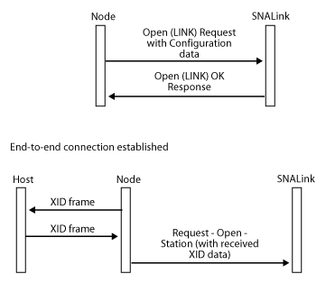

# SNALink Configuration Information
The configuration information for all SNALinks on a computer is stored hierarchically, referenced by the SNALink name.  
  
 The entry for each SNALink must include certain fields that are required by the Host Integration Server system. These are listed in the following table.  
  
|Required field|Description|  
|--------------------|-----------------|  
|TYPE|The type of the SNALink. Acceptable values for TYPE are: SDLC, X25, TOKENRING, TCPIP, FRAMERELAY, CHANNEL, ISDN, ETHERNET.|  
|LINKMODULE|The name of the IHV DLL that provides the protocol code.|  
  
 The remainder of the configuration information consists of entries of the form PARAMETER = VALUE. Parameters can be set to either an integer or a string.  
  
 Examples of possible parameters that may be required by an SNALink are as follows:  
  
- PortNumber = 3  
  
- LineType = SWITCHED  
  
- L3PacketSize = 128  
  
- T1Timeout = 30  
  
  Note that to support more than one port on a multiport adapter, you must define multiple SNALinks. It is not possible to configure a single SNALink to support more than one physical link.  
  
  The following figure shows a sample configuration for a computer with two SNALinks—SDLC1 and X25HOST.  
  
    
  Sample configuration for a computer with two SNALinks  
  
  The configuration information is accessed using API calls that Host Integration Server provides.  
  
  The IHV Setup utility must write the configuration information for each SNALink supported. See [Setup Information (SNADIS)](../core/setup-information-snadis-1.md) for information about how this should be performed.  
  
## In This Section  
 [Accessing Configuration Information](../core/accessing-configuration-information2.md)