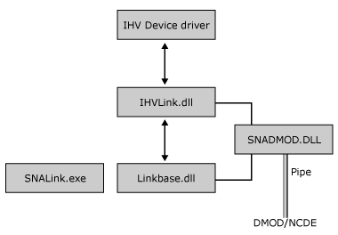

# SNALink Structure (SNADIS)
A [!INCLUDE[hishostintegrationserver2009](../core/includes/hishostintegrationserver2009-md.md)] SNALink consists of the following:  
  
-   The link-specific protocol code provided by the independent hardware vendor (IHV)  
  
-   A Base  
  
-   A Dynamic Access Module (DMOD)  
  
 The DMOD, Base, and the IHV link-specific component of a Host Integration Server SNALink are implemented as dynamic-link libraries (DLLs). The executable component SNALINK.EXE is used to start a SNALink. SNALINK.EXE determines (from the Host Integration Server configuration) which link support DLL (for example, IHVLINK.DLL) is required and dynamically loads it before entering the Base scheduler.  
  
 The following figure shows the executable structure of a SNALink.  
  
   