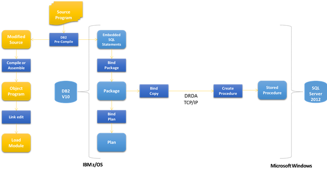

# Static SQL Packages
The DRDA Service supports both dynamic and static SQL statement execution. The DRDA Server will process dynamic SQL statements, for example the DRDA commands EXCSQLIMM (Execute Immediate SQL Statement) and EXCSQLSTT (Execute SQL Statement), by converting a basic set of ANSI SQL 92 Entry-Level DB2 syntax to Microsoft SQL Server T-SQL syntax. The DRDA Service will process static SQL statements in two steps: (1) bind-time and (2) run-time.  
  
 At bind-time, the DRDA Service will process BGNBND (Begin Binding a Package to an RDB) and BNDSQLSTT (Bind SQL Statement to an RDB Package) into a SQL Server T-SQL stored procedure. Optionally, the DRDA Service can process binds into Microsoft static SQL for DB2 XML files or can process binds by calling a custom replaceable bind listener (e.g. custom or third-party package binder that can support a broader set of SQL syntax conversions). For more information on the package XML format supported by the Microsoft DRDA Client and DRDA Service, see topic titled Static SQL for DB2.  
  
 At run-time, the DRDA Service will process PRPSQLSTT (Prepare SQL Statement), EXCSQLSTT (Execute SQL Statement), and OPNQRY (Open Query) commands into T-SQL CALL statements. To support server cursor operations, the DRDA Service will process OPNQRY into an open cursor command, CNTQRY (Continue Query) into a fetch command, and CLSQRY (Close Query) into a close cursor command. The DRDA Service will process commit, rollback, and synchronize log commands as part of its support for DRDA DUW (Distributed Unit of Work).  
  
## Package Naming Convention  
 DRDA defines a fully-qualified static SQL package using a PKGNAM (RDB Package Name) that consists of these multiple parts.  
  
-   RDBNAM (Relational Database Name)  
  
-   RDBCOLID (RDB Collection Identifier)  
  
-   PKGID (RDB Package Identifier)  
  
```  
RDBNAME.RDBCOLID.PKGID.PKGCNSTKN.PKGSN  
```  
  
 The previous example shows the fully-qualified package name with a consistency token.  
  
> [!WARNING]
>  If more than one package has the same value for PKGNAM, then the packages are distinguished by the VRSNAM (Version Name) or PKGCNSTKN (package name consistency token).  
  
-   PKGCNSTKN (RDB Package Consistency Token)  
  
-   VRSNAM (Version Name)  
  
## Converting packages to stored procedures  
 The DRDA Service converts static SQL for DB2 packages and embedded SQL statements into SQL Server stored procedures, by processing DRDA BGNBND (Begin Bind) and BNDSQLSTT (Bind SQL Statement) protocol flows and formatted data values. Optionally, the DRDA Service can processing binds as XML files, for later conversion into stored procedures or troubleshooting purposes. Further, the DRDA Service can invoke a custom bind listener component to process BGNBND and BNDSQLSTT flows. See the Operations book for more information on processing package bind flows. See Programmer’s Guide and Programmer’s Reference for information on custom bind listeners.  
  
   
  
 In the previous illustration, DB2 for z/OS embedded SQL is converted to DB2 packages during the DB2 pre-complie phase, and then converted to DRDA BGNBND and BNDSQLSTT flows during the DB2 bind copy phase, and then converted to SQL Server stored procedures by the DRDA Service when processing the DRDA bind package and statements flows.  
  
## Static SQL Package Statements  
 The IBM DB2 for z/OS product and documentation includes a set of installation verification test sample programs, including a COBOL for z/OS  
  
```  
EXEC SQL CONNECT TO :TEMPLOC END-EXEC  
EXEC SQL INSERT INTO VHDEPT   
VALUES (:DEPT-NUMB, :DEPT-NAME, :DEPT-MGR,   
:DEPT-ADMR, :DEPT-LOC)  
END-EXEC.  
  
```  
  
 The previous example shows IBM DB2 for z/OS sample COBOL program with embedded SQL CONNECT and INSERT statements.  
  
```  
CONNECT TO :H  
INSERT INTO VHDEPT VALUES (:H, :H, :H, :H, :H )  
  
```  
  
 The previous example shows IBM DB2 for z/OS sample COBOL program embedded SQL statement extracted by DB2 pre-compiler and stored in a static SQL for DB2 package—one section per statement.  
  
```  
<Section Number="18" Alias="">  
  <Statement Number="18">INSERT INTO VHDEPT VALUES ( :H , :H , :H , :H , :H ) </Statement>  
  <Parameters>  
    <Parameter Name="DEPT-NUMB" Type="Char" Length="3" Precision="0" Scale="0" CCSID="37" Nullable="False" />  
    <Parameter Name="DEPT-NAME" Type="Char" Length="36" Precision="0" Scale="0" CCSID="37" Nullable="False" />  
    <Parameter Name="DEPT-MGR" Type="Char" Length="6" Precision="0" Scale="0" CCSID="37" Nullable="False" />  
    <Parameter Name="DEPT-ADMR" Type="Char" Length="3" Precision="0" Scale="0" CCSID="37" Nullable="False" />  
    <Parameter Name="DEPT-LOC" Type="Char" Length="16" Precision="0" Scale="0" CCSID="37" Nullable="False" />  
  </Parameters>  
</Section>  
```  
  
 The previous example shows IBM DB2 for z/OS sample COBOL program static SQL for DB2 package statements converted by the DRDA Service into a static SQL for DB2 XML file section. DB2 for z/OS does not include the CONNECT statement in the remote DRDA-defined package.  
  
```  
/****** BNDOPT: <Options><BNDCHKEXS>BNDEXSOPT</BNDCHKEXS><BNDCRTCTL>BNDNERALW</BNDCRTCTL><BNDEXPOPT>EXPNON</BNDEXPOPT><DFTRDBCOL>CXE001</DFTRDBCOL><DGRIOPRL>1</DGRIOPRL><PKGATHOPT>PKGATHKP</PKGATHOPT><PKGISOLVL>ISOLVLCS</PKGISOLVL><PKGOWNID>CXE001</PKGOWNID><PKGRPLOPT>PKGRPLALW</PKGRPLOPT><QRYBLKCTL>FIXROWPRC</QRYBLKCTL><RDBRLSOPT>RDBRLSCMM</RDBRLSOPT><STTDATFMT>USADATFMT</STTDATFMT><STTDECDEL>DECDELPRD</STTDECDEL><STTSTRDEL>STRDELAP</STTSTRDEL><STTTIMFMT>USATIMFMT</STTTIMFMT></Options> ******/  
  
CREATE PROCEDURE [DSN8910].[DSN8HC3_18BBB2BA1492DAC8_19] @DEPT_NUMB Char(3), @DEPT_NAME Char(36), @DEPT_MGR Char(6), @DEPT_ADMR Char(3), @DEPT_LOC Char(16)  
AS  
begin  
      INSERT INTO VHDEPT VALUES ( @DEPT_NUMB , @DEPT_NAME , @DEPT_MGR , @DEPT_ADMR , @DEPT_LOC )   
      return @@ROWCOUNT  
end  
GO  
  
```  
  
 The previous example shows IBM DB2 for z/OS sample COBOL program static SQL for DB2 package statements converted by the DRDA Service into a SQL Server CREATE PROCEDURE statement.  
  
## DRDA Service Package Bind Options  
 The DRDA BGNBND (Begin Bind) flow includes a set of package bind options that can influence the storage and execution of the runtime package. The DRDA Service maps a limited number of bind options to SQL Server constructs. The DRDA Service preserves the bind options in the static SQL for DB2 package XML file, as comments within the stored procedure, and optionally as extended properties on the stored procedure.  
  
### Bind Package Creation Control  
 The DRDA Service supports the DRDA BGNBND BNDCRTCTL (Bind Package Creation Control), which instructs the MsDrdaService to skip over bind errors. The BNDCRTCTL code point supports an enumeration of values.  
  
- BNDCHKONL(Bind Check Only)  
  
- BNDNERALW (Bind No Errors Allowed)  
  
- BNDERRALW (Bind Errors Allowed)  
  
- BNDNERALW (Bind No Errors Allowed)  
  
  By default, the DRDA Service defaults to BNDNERALW (Bind No Errors Allowed). The DRDA Service returns a BGNBNDRM (BGNBND Reply Message) with an error indicating the problem, when one of the following instances occurs.  
  
- DRDA-to-XML conversion problem  
  
- XML-to-DDL conversion problem  
  
- Custom bind listener does return DDL on the callback interface  
  
- DRDA Service cannot execute the DDL statement  
  
  To instruct the DRDA Service to ignore errors and continue processing a package, the DRDA AR client should specify BNDCRTCTL option BNDERRALW (Bind Errors Allowed).  
  
  When using the DB2 Administrative tool with DB2 for z/OS, the DB2 administrator can specify the option SQLERROR “C” (Continue). When using the DB2 bind copy tool with DB2 for z/OS, the DB2 programmer can navigate to the DB2 BIND PACKAGE panel, specify CHANGE CURRENT DEFAULTS=YES, and then set SQLERROR PROCESSING=C.  
  
### Bind Package Replace  
 The DRDA Service supports the DRDA BGNBND PKGRPLOPT (Package Replacement Option), which instructs the MsDrdaService to drop and re-create the package stored procedure. The PKGRPLOPT code point supports a Boolean value.  
  
 Currently, we add but do not replace packages, when processing BGNBND (Begin Bind) BNDSQLSTT (Bind SQL Statement). This option instructs DB2 for z/OS to drop and create a new copy of the package.  
  
- PKGRPLALW (Package Replacement Allowed)  
  
- PKGRPLNA (Package Replacement Not Allowed)  
  
  By default, the DRDA Service defaults to PKGRPLALW (Package Replacement Allowed). The DRDA Service executes a DROP PROCEDURE statement prior to executing a CREATE PROCEDURE statement.  
  
### Bind Options List  
 The following are a list of the package bind options defined in the static SQL for DB2 package XML file. The format of these elements, types and values differ from version of Host Integration Server to another. In HIS 2010 (V8.5), the technology supported a version 8.5 format of these bind options. In HIS 2013 (V9.0), the technology supports a version 9.0 format of these bind options, which is more verbose and descriptive. The HIS 2013 technology includes an XSD schema file for use with the static SQL for DB2 package XML file  
  
## DRDA Service Static SQL Cursors  
 The DRDA Service transforms static SQL for DB2 packages into SQL Server stored procedures, when processing DRDA begin bind and bind SQL statements commands, including embedded SQL DECLARE CURSOR statements. Depending on the cursor type, the DRDA Service defines the stored procedure to include additional input parameters (“INVOKE_TYPE”) to define the action on the cursor (e.g. open, fetch, close). The DRDA Service includes comments in the SQL Server stored procedure to denote the bind options (e.g. fixed row protocol) and cursor type (e.g. global, for update, read only).  
  
### Declare and Open a Cursor  
 The DRDA Service opens a cursor by calling a SQL Server stored procedure with an invoke type parameter argument “@*_INVOKE_TYPE\\*\_ = 0”, in response to a DRDA AR OPNQRY (Open Query) to support a consumer program’s DECLARE CURSOR and OPEN CURSOR commands, returning a single row to the DRDA AR in a reply to the DRDA OPNQRY command called a QRYDTA (Query Answer Data Set).  
  
### Fetch against a Cursor  
 The DRDA Service fetches against a cursor by calling a SQL Server stored procedure with an invoke type parameter argument “@*_INVOKE_TYPE\\*\_ = 1” and parameter argument @\_*FETCH_ROW_COUNT\\*\_ = n”, in response to a DRDA AR CNTQRY (Continue Query) to support a consumer program’s FETCH commands, returning a single row or multiple (n) rows to the DRDA AR in a reply to the DRDA CNTQRY command called a QRYDTA (Query Answer Data Set).  
  
 To improve performance, the DRDA Service returns multiple rows per fetch when possible, unless the package or cursor is defined for single row fetch to support concurrent updating. See description of SQL clause syntax and bind options below.  
  
### Close a Cursor  
 The DRDA Service closes a cursor by calling a SQL Server stored procedure with an invoke type parameter argument “@*_INVOKE_TYPE\\*\_ = 2”, in response to a DRDA AR CLSQRY (Close Query) to support a consumer program’s CLOSE CURSOR command, returning to the DRDA AR a reply to the DRDA CLSQRY command called a ENDQRYRM (End of Query Reply Message).  
  
 If the DECLARE CURSOR statements includes a SQL clause WITH HOLD, then the DRDA Service defines the stored procedure with a DECLARE CURSOR GLOBAL option. In this case, and SQL Server will retain the cursor over close and commit requests for the duration of the DRDA AR to DRDA Service to SQL Server connection.  
  
## SQL Clause Syntax  
 The DRDA Service will include a RETURN_RESULTSET comment in the stored procedure when the DECLARE CURSOR SQL statement includes the SQL clause DECLARE CURSOR FOR SELECT.  
  
 The DRDA Service will include a CURSOR_WITH_HOLD comment in the stored procedure when the DECLARE CURSOR SQL statement includes the SQL clause WITH HOLD. The DRDA Service defines the stored procedure with a DECLARE CURSOR GLOBAL option, and SQL Server will retain the cursor over close and commit requests for the duration of the DRDA AR to DRDA Service to SQL Server connection.  
  
 The DRDA Service will include a CURSOR_FOR_UPDATE comment in the stored procedure when the DECLARE CURSOR SQL statement includes the SQL clause FOR UPDATE. The DRDA Service defines the stored procedure without the parameter argument @*_FETCH_ROW_COUNT\\*\_ = n”. The DRDA Service will return a single row per fetch only.  
  
 Depending on bind option, the DRDA Service interprets the SQL clause syntax FOR READ ONLY and FOR FETCH ONLY as denoting a non-updateable cursor, against which the DRDA Service can fetch multiple rows per CNTQRY. The DRDA Service defines the stored procedure with the parameter argument @*_FETCH_ROW_COUNT\\*\_ = n”. The DRDA Service will return a single row or multiple rows per fetch based on the bind option.  
  
```  
DECLARE C2 CURSOR WITH HOLD FOR SELECT SALESKEY FROM CONTOSO.DSN8910.BULKTST1 FOR READ ONLY  
DECLARE C4 CURSOR WITH HOLD FOR SELECT SALESKEY FROM CONTOSO.DSN8910.BULKTST1 FOR FETCH ONLY DECLARE C8 CURSOR WITH HOLD FOR SELECT SALESKEY FROM CONTOSO.DSN8910.BULKTST1  
```  
  
 Examples of SELECT statements defined using LMTBLKPRC that include fetch row count parameter.  
  
### Package Bind Option  
 The DRDA Service interprets the DRDA BGNBND (Begin Bind) option QRYBLKCTL (Query Block Protocol Control) as an override to the cursor type and SQL clause syntax, instructing the DRDA Service to return either a single row per fetch or multiple rows per fetch on non-updateable cursors.  
  
 The default QRYBLKCTL is LMTBLKPRC(Limited Block Query Protocol), which instructs the DRDA Service to return multiple rows per query block, as many as will fit on average into a 32K block less the byes required for the DRDA DSS (Data Stream Structures) for defining the column data types.  
  
 Optionally, the DB2 programmer can bind a package with DB2 CURRENTDATA=YES bind option, which is translated to DRDA BGNBND (Begin Bind) option QRYBLKCTL (Query Block Protocol Control) FIXROWPRC (Fixed Row Query Protocol), to instruct the DRDA Service to return a single (fixed row) per CNTQRY (Continue Query) in response to the program’s SQL FETCH statement.  
  
### No Cursor Required  
 If the bind option is the default LMTBLKPRC, the Data Server defines a stored procedure with a SELECT statement but no DECLARE CURSOR, when the statement is unambiguously read-only. See description of SQL clause syntax and bind options below.  
  
```  
DECLARE C1 CURSOR FOR SELECT SALESKEY FROM CONTOSO.DSN8910.BULKTST1 FOR READ ONLY  
DECLARE C3 CURSOR FOR SELECT SALESKEY FROM CONTOSO.DSN8910.BULKTST1 FOR FETCH ONLY  
DECLARE C7 CURSOR FOR SELECT SALESKEY FROM CONTOSO.DSN8910.BULKTST1  
  
```  
  
 Examples of SELECT statements that do not require SQL Server cursors.