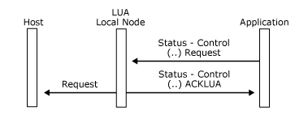
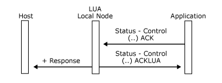
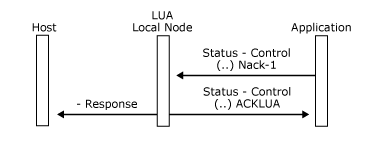

# Status-Control (ACKLUA) Message
When a logical unit application (LUA) application sends a **Status-Control** message inbound to the local node, the LUA verb used to send the message cannot complete until the local node acknowledges the message. Because of this, the local node will always respond to the LUA application after it has completed its send checking of the inbound message. If the inbound message passes the local node's send checks, and the corresponding SNA message will be sent to the host, the local node sends a [Status-Control(...) ACKLUA](../core/status-control-acklua2.md) message to the application to indicate this. Note that the **ACKLUA** message does not imply that the SNA message was successfully sent to the host, or that the host received it.  
  
 The format of the **Status-Control(...) ACKLUA** message is explained in [Status-Control(...) ACKLUA](../core/status-control-acklua2.md). Note that the use of the message key field in **Status-Control(...) ACKLUA** is different from other **Status-Control** messages. It contains the sequence number from the transmission header (TH) of the **Status-Control** message sent by the LUA application, not the message key.  
  
 If the inbound message fails the local nodes send checking, a [Status-Control(...) Negative-Acknowledge-2](../core/status-control-negative-acknowledge-22.md) message will be returned as for non-LUA applications. (This is then reported to the LUA application by a non-OK return code to the LUA verb that sent the message.)  
  
 The following three figures illustrate the **ACKLUA** acknowledgment protocol for different messages that the application can send.  
  
 In the first figure, the application sends a **Status-Control(...) Request** message that passes the send checks of the local node.  
  
   
Application sends a Status-Control() Request message  
  
 In the following figure, the application sends a **Status-Control(...) Acknowledge** message that passes the send checks of the local node.  
  
   
Application sends a Status-Control(...) Acknowledge message  
  
 In the following figure, the application sends a **Status-Control(...) Negative-Acknowledge-1** message that passes the send checks of the local node.  
  
   
Application sends a Status-Control() Negative Acknowledge-1 message  
  
## See Also  
 [Status-Acknowledge Message](../core/status-acknowledge-message1.md)   
 [Status-Control Message](../core/status-control-message1.md)   
 [Status-Error Message](../core/status-error-message1.md)   
 [Status-Resource Message](../core/status-resource-message1.md)   
 [Status-Session Message](../core/status-session-message1.md)   
 [Status-RTM Message](../core/status-rtm-message1.md)