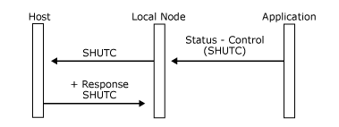

# Status-Control Message
**Status-Control** messages provide access to session control and data flow control protocols on the primary logical unit (PLU) session using the PLU connection. They are not used on the other connections. **Status-Control** messages map directly to the equivalent SNA session control and data flow control request/response units (RUs).  
  
 All **Status-Control** messages that correspond to SNA requests on the normal flow with the exception of LUSTAT-sent Request Exception (RQE), and **Status-Control** messages corresponding to **CLEAR** and **STSN** request on the expedited flow, have the **ACKRQD** (acknowledgment required) field set. **Status-Control** messages that correspond to SNA requests on the expedited flow (with the exception of **CLEAR** and **STSN**) do not have the **ACKRQD** field set by the local node. However, the application can set **ACKRQD** when sending these **Status-Control** messages. The last figure in this topic summarizes which **Status-Control** requests always have **ACKRQD** set.  
  
 If a **Status-Control** request has **ACKRQD** set in the message header, the recipient must supply a **Status-Control** response (**Acknowledge, Negative-Acknowledge-1** or **Negative-Acknowledge-2**) before the sender sends further [Data](./data1.md) messages or further **Status-Control** requests on the flow. The sender can still send **Status-Control** responses, **Status-Acknowledge**, **Status-Error**, and **Status-Resource** messages on the flow. This applies to both normal and expedited flows and all request modes (including delayed-request mode). The message key received on the request must be returned on the response. (This is to allow multiple **RQE LUSTAT** messages to be outstanding.) The local node increments the message key on **Status-Control** requests and **DATAFMI** messages that it sends to the application on the PLU connection.  
  
 For the logical unit application (LUA) variant of the function management interface (FMI), the message key field is used in a different way, as follows:  
  
- For inbound expedited flow requests, the local node sets the SNA sequence number to the value supplied by the application in the message key field. The application must ensure that this field is set to the correct sequence number.  
  
- For inbound **Status-Control** responses, the local node sets the SNA sequence number to the value supplied by the application in the message key field. The application must ensure that this field is set to the sequence number of the request for which a response is being sent.  
  
  Except in the case of **Status-Control(LUSTAT)**, if a **Status-Control** request does not have **ACKRQD** set, the application should not reply, because a positive response has already been sent by the local node.  
  
  For example, if the application sends a **Status-Control(QC) Request** with **ACKRQD** set (corresponding to an SNA request on the normal flow), this blocks further data and **Status-Control** requests corresponding to the inbound normal flow until the **Status-Control(QC)** response is received. It does not block other messages on the normal flow, or messages on the expedited flow. For example, the application could still send **Status-Control(SIGNAL)**.  
  
  The receipt of the **Status-Control** response implies an acknowledgment to all outstanding messages (including **Data** messages) on the flow.  
  
  The use of **ACKRQD** on **Status-Control** messages effectively enforces definite-response and immediate request mode. This is appropriate for:  
  
- **Status-Control** messages that correspond to the SNA requests **CLEAR** and **STSN** (because the expedited flow is **RQD**).  
  
- **Status-Control** messages corresponding to all the **DFC** requests (which are **RQD**) except **LUSTAT** (which can be **RQE**).  
  
  The application can set **ACKRQD** on **Status-Control** requests that correspond to SNA requests on the expedited flow, even where **ACKRQD** is not required. For example, when an application is signaling for direction (for example, a 3270 emulator with a terminal operator repeatedly pressing the ATTN key), it can generate multiple **Status-Control(SIGNAL) Request** messages, which would adversely affect the performance of other users. The application can set **ACKRQD** on the first **Status-Control(SIGNAL) Request** and ignore events that would cause further **Status-Control(SIGNAL) Request** messages until the **Status-Control(SIGNAL) Response** is received from the local node.  
  
  The message flows in the following six figures show outbound and inbound **Status-Control** sequences with and without **ACKRQD** and the corresponding SNA RUs.  
  
  In the first figure, the application sends **Status-Control(CHASE)**.  
  
    
  Application sends Status-Control(CHASE)  
  
  In the following figure, the host sends **BID** request.  
  
    
  Host sends BID request  
  
  In the following figure, the application sends **Status-Control(SHUTC)**.  
  
    
  Application sends Status-Control(SHUTC)  
  
  In the following figure, the host sends SNA **SIGNAL** request.  
  
    
  Host sends SNA SIGNAL request  
  
  In the following figure, the host sends multiple **RQE LUSTAT** requests, and the application rejects the first one.  
  
    
  Application rejects the first RQE LUSTAT request  
  
  In the following figure, the application sends **Status-Control(LUSTAT) NOACKRQD**.  
  
    
  Application sends Status-Control(LUSTAT) NOACKRQD  
  
  The following table summarizes the **Status-Control** requests supported by the local node and SNA session control (SC) and data flow control (DFC) requests. For each **Status-Control** request, the table gives:  
  
- The SNA category of the corresponding SNA request (SC or DFC).  
  
- The flow used by the corresponding SNA request (normal or expedited).  
  
- The TS or FM profiles on which the corresponding SNA request is supported.  
  
- The directions for which it is valid (NODE \<–> APPL).  
  
- Whether it requires **ACKRQD**. Note that the application can set ACKRQD on a Status-Control request that does not require it.  
  
- The hexadecimal code used in the control-type field of the Status-Control message. (For more information, see [FMI Message Formats](./fmi-message-formats2.md).)  
  
|Status-Control|SNA RQ flow|TS profile|FM profile|Direction node–appl|ACKRQD|Code|  
|---------------------|-----------------|----------------|----------------|-------------------------|------------|----------|  
|CLEAR|SC,Exp|2,3,4|–|–>|ACKRQD|CCLEAR (0x01)|  
|SDT|SC,Exp|3,4|–|–>|–|CSDT (0x02)|  
|RQR|SC,Exp|4|–|\<–|–|CRQR (0x03)|  
|STSN|SC,Exp|4|–|–>|ACKRQD|CSTSN (0x04)|  
|CANCEL|DFC,Norm|–|3,4,7|\<–>|ACKRQD|CCANCEL (0x10)|  
|LUSTAT|DFC,Norm|–|3,4,7|\<–>|–|CLUSTAT (0x11)|  
|SIGNAL|DFC,Exp|–|3,4,7|\<–>|–|CSIGNAL (0x12)|  
|RSHUTD|DFC,Exp|–|3,4,7|\<–|–|CRSHUTD (0x13)|  
|BID|DFC,Norm|–|3,4|–>|ACKRQD|CBID (0x14)|  
|CHASE|DFC,Norm|–|3,4|\<–>|ACKRQD|CCHASE (0x15)|  
|SHUTC|DFC,Exp|–|3,4|\<–|–|CSHUTC (0x16)|  
|SHUTD|DFC,Exp|–|3,4|–>|–|CSHUTD (0x17)|  
|RTR|DFC,Norm|–|3,4|<–|ACKRQD|CRTR (0x18)|  
|QC|DFC,Norm|–|4|\<–>|ACKRQD|CQC (0x20)|  
|QEC|DFC,Exp|–|4|\<–>|–|CQEC (0x21)|  
RELQ|DFC,Exp|–|4|\<–>|–|CRELQ (0x22)|  
  
 The requests in the following table are used only with LUA. (For more information, see [FMI Concepts](../core/fmi-concepts1.md).)  
  
|Status-Control|SNA RQ flow|TS profile|FM profile|Direction node–appl|ACKRQD|Code|  
|---------------------|-----------------|----------------|----------------|-------------------------|------------|----------|  
|CRV|SC,Exp|3,4|–|–>|ACKRQD|CCRV (0x05)|  
|BIS|DFC,Norm|–|18|\<–>|ACKRQD|CBIS (0x19)|  
|SBI|DFC,Exp|–|18|\<–>|ACKRQD|CSBI (0x1A)|  
  
 The use of particular **Status-Control** messages is described in following topics of this section, in the context of PLU session protocols such as chaining, brackets, recovery, and so on.  
  
 For the formats of **Status-Control** messages, see [Status-Control](./status-control1.md).  
  
## In This Section  
  
-   [Status-Control (ACKLUA) Message](../core/status-control-acklua-message1.md)