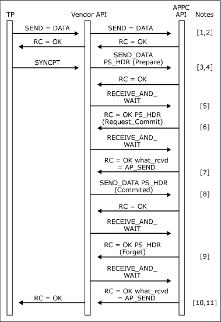

# SYNCPT Verb Issued Locally
This section provides an example verb sequence with a verb issued locally.  
  
   
SYNCPT verb issued locally.  
  
1.  The transaction program issues a [SEND_DATA](../Topic/SEND_DATA2.md) or [MC_SEND_DATA](../Topic/MC_SEND_DATA2.md)verb depending on whether a basic or mapped conversation is being used.  
  
2.  The **SEND_DATA** or **MC_SEND_DATA** VCB is passed transparently through the vendor API to [!INCLUDE[hishostintegrationserver2009](../core/includes/hishostintegrationserver2009-md.md)]. When the verb completes, the return code from Host Integration Server is returned to the transaction program.  
  
3.  The transaction program issues a **SYNCPT** verb to the vendor API.  
  
4.  The vendor API creates a PREPARE PS header and transmits it by issuing a **SEND_DATA** or **MC_SEND_DATA** verb. For a mapped conversation, the data_type field of the **MC_SEND_DATA** VCB must be set to AP_PS_HEADER.  
  
5.  On completion of the **SEND_DATA** or **MC_SEND_DATA** verb, the vendor API issues a [RECEIVE_AND_WAIT](../Topic/RECEIVE_AND_WAIT1.md) or [MC_RECEIVE_AND_WAIT](../Topic/MC_RECEIVE_AND_WAIT1.md) verb.  
  
6.  The **RECEIVE_AND_WAIT** or **MC_RECEIVE_AND_WAIT** verb completes with the **what_rcvd** field of the VCB with a value of AP_PS_HEADER. The data buffer is filled with the received REQUEST_COMMIT PS header.  
  
7.  Another **RECEIVE_AND_WAIT** or **MC_RECEIVE_AND_WAIT** verb is issued to get send direction. Note that the vendor API can combine these two verbs into a single request by setting the **rtn_status** field of the VCB to AP_YES in order to receive status with data on the first [RECEIVE_AND_WAIT](../Topic/RECEIVE_AND_WAIT1.md) or [MC_RECEIVE_AND_WAIT](../Topic/MC_RECEIVE_AND_WAIT1.md).  
  
8.  A COMMITTED PS header is then transmitted using a [SEND_DATA](../Topic/SEND_DATA2.md) or [MC_SEND_DATA](../Topic/MC_SEND_DATA2.md) verb.  
  
9. The Vendor API issues a **RECEIVE_AND_WAIT** or **MC_RECEIVE_AND_WAIT** verb to receive the FORGET PS header from the remote TP.  
  
10. Another **RECEIVE_AND_WAIT** or **MC_RECEIVE_AND_WAIT** verb is issued with the **what_rcvd** field of the VCB set to AP_SEND to get send direction (again the **rtn_status RECEIVE_AND_WAIT** field of the VCB can be set to AP_YES to combine these two verbs).  
  
11. When send indication is received, the vendor API returns the **SYNCPT** verb to the local transaction program with an OK return code.