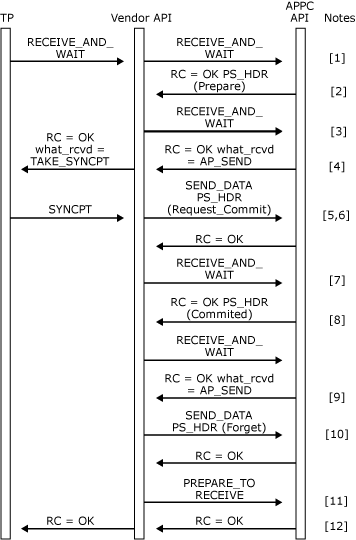

# SYNCPT Verb Issued Remotely
  
SYNCPT verb issued remotely.  
  
1.  The local TP issues a [RECEIVE_AND_WAIT](./receive-and-wait2.md) or [MC_RECEIVE_AND_WAIT](./mc-receive-and-wait2.md)verb (depending on whether a basic or mapped conversation is being used) to receive data from the remote transaction program. The vendor API passes the verb transparently to Host Integration Server.  
  
2.  The **RECEIVE_AND_WAIT** or **MC_RECEIVE_AND_WAIT** verb completes with **what_rcvd** = AP_PS_HEADER. The data buffer contains a PREPARE PS header.  
  
3.  Another **RECEIVE_AND_WAIT** or **MC_RECEIVE_AND_WAIT** verb is issued by the vendor API to receive the send indication from the remote TP.  
  
4.  The vendor API returns the transaction program's **RECEIVE_AND_WAIT** or **MC_RECEIVE_AND_WAIT** verb with the **what_rcvd** field of the VCB set to TAKE_SYNCPT.  
  
5.  The transaction program issues a **SYNCPT** verb.  
  
6.  The vendor API generates a REQUEST_COMMIT PS header and transmits it using a [SEND_DATA](./send-data1.md) or [MC_SEND_DATA](./mc-send-data1.md) verb. If the conversation is mapped, the **MC_SEND_DATA** verb is issued with the **data_type** field of the VCB set to AP_PS_HEADER.  
  
7.  The vendor API then issues a [RECEIVE_AND_WAIT](./receive-and-wait2.md) or [MC_RECEIVE_AND_WAIT](./mc-receive-and-wait2.md) verb to give the remote TP direction to send.  
  
8.  The **RECEIVE_AND_WAIT** or **MC_RECEIVE_AND_WAIT** verb completes with the **what_rcvd** field of the VCB set to AP_PS_HEADER. The data buffer contains a COMMITTED PS header.  
  
9. Another **RECEIVE_AND_WAIT** or **MC_RECEIVE_AND_WAIT** verb is issued to get permission to send.  
  
10. A FORGET PS header is prepared and sent to the remote transaction program.  
  
11. The FORGET is flushed and direction given to the remote transaction program by issuing a [PREPARE_TO_RECEIVE](./prepare-to-receive2.md) or [MC_PREPARE_TO_RECEIVE](./mc-prepare-to-receive1.md) with the **ptr_type** field of the VCB set to AP_FLUSH.  
  
12. When the **PREPARE_TO_RECEIVE** or **MC_PREPARE_TO_RECEIVE** verb completes, the vendor API returns the **SYNCPT** verb to the local transaction program.
