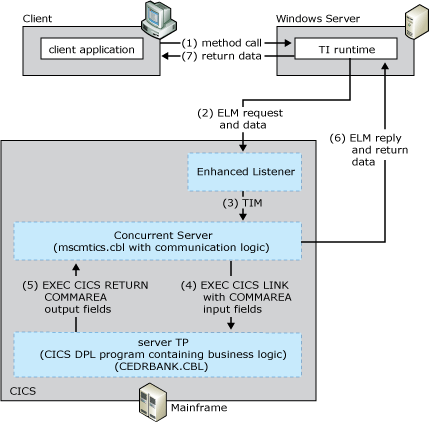

# TCP Enhanced Listener Message Link
The TCP enhanced listener message (ELM) Link model allows data and parameters to be passed between TI and the server TP using the COMMAREA. The model also allows a Concurrent Server to link to a CICS DPL program. The enhanced Listener was introduced in CICS Transaction Server version 1.4, and its architecture increases the efficiency of the CICS TCP/IP environment by eliminating the TRM and TRM Reply sequence sequence. The enhanced Listener accepts a header and request data from the client in the initial stream and eliminates the need for the server application to deliver a separate response before the application data is made available. The enhanced Listener requires the client to:  
  
- Construct and send a single data stream composed of a request header followed by the application request data to the server application program  
  
- Receive a single data stream that consists of a reply header and application data from the server application program  
  
  The following figure summarizes the workflow occurring between the client, the enhanced CICS Listener, the Concurrent Server, and the mainframe transaction program. The numbers in parentheses indicate the approximate order in which events occur. A more detailed description of the events follows the figure.  
  
    
  
## Summary workflow diagram for the TCP ELM Link programming model  
 The TCP ELM Link programming model works as follows:  
  
1. An application invokes a method in a TI component configured in Component Services or the .NET Framework.  
  
2. The TI runtime calls the TI Automation proxy.  
  
3. If the application is a COM+ component, the TI Automation proxy:  
  
   1. reads in the type library created previously by the TI Designer  
  
   2. maps the automation data types to COBOL data types  
  
      If the application is a .NET Framework assembly, the TI Automation proxy:  
  
   3. reads in the assembly and meta data created previously by the TI Designer  
  
   4. maps the .NET Framework data types to COBOL data types  
  
      The TI Automation proxy then:  
  
   5. calls the conversion routines to convert the application data to mainframe COBOL types  
  
   6. builds the flattened data stream buffer that represents the COBOL declaration or copybook.  
  
   7. passes the message to the TCP transport component.  
  
4. The TI TCP transport sends a connect request to the enhanced Listener using the Internet Protocol (IP) address of the mainframe computer and the port address of the Listener.  
  
5. The enhanced Listener accepts the connection request and tells TI runtime to send the ELM. The enhanced Listener then waits for the ELM.  
  
    The ELM is a formatted data record that identifies the server TP to be invoked by using its TRANID. The Listener TP is a special mainframe TP, whose main function is to receive server TP invocations sent by client applications running TCP/IP. The TRANID of the IBM-provided enhanced Listener TP is defined by the user.  
  
6. TI run-time formats the ELM and sends it to the enhanced Listener. TI then bypasses the transport logic that waits for a ELM reply and immediately sends the application request data after the request header. TI then waits for the ELM reply.  
  
7. The enhanced Listener receives the 35 byte ELM, and then reads the contents of the ELM header. The enhanced Listener places the 35 bytes in the transaction initial message (TIM) but does not operate on its content.  
  
    The TIM describes the TCP/IP environment in which the server is running and contains the TCP/IP socket information the concurrent server uses to communicate with the COMTI TCP Transport and the client message header the concurrent server uses to customize its execution behavior. The header contains the name of the server program to be linked to.  
  
8. The enhanced Listener starts the concurrent server TP program (Mscmtics.cbl sample application) that is defined in the Listener Definition.  
  
    Mscmtics.cbl is the Microsoft sample TP file that is used to pass data between TI and the server TP using the COMMAREA. The Mscmtics.cbl sample TP is developed by Microsoft and provided as part of the [!INCLUDE[hisHostIntServNoVersion](../includes/hishostintservnoversion-md.md)] software. It is located in the $\Microsoft Host Integration Server\SDK\Samples\Comti\ProgrammingSpecifics\Tcp. It must be compiled, linked, and installed on the mainframe computer prior to using this model.  
  
   > [!NOTE]
   >  If the enhanced Listener is unable to start the Concurrent Server, the Listener formats an error message and sends it back to the COMTI TCP Transport. Reasons the Listener might be unable to start include:  
  
   -   rejected connection due to limited CICS resources (for example, exceeds the maximum number of CICS tasks or concurrent server tasks)  
  
   -   invalid or disabled TRANID for the concurrent server  
  
   -   invalid, disabled or unavailable Concurrent Server program associated with the transaction ID  
  
   > [!NOTE]
   >  The error message from the CICS listener is character based and always begins with the letters EZY. The length of the error message is variable, and the end of the message is determined by the socket closed by the CICS Listener.  
  
9. The enhanced Listener calls the socket application protocol interface (API) in the host environment. After the enhanced Listener has issued the start command for the concurrent server transaction, the enhanced Listener is out of the application processing loop and is free to listen for another incoming request.  
  
10. The concurrent server retrieves the TIM, connects the socket, and reads the contents of the ELM.  
  
11. TI passes the application data through the CICS COMMAREA to the server application program that contains the business logic using a standard EXEC CICS Link call. TI runtime also issues a shutdown for the sending 1/2 socket and then waits for the reply data.  
  
12. The server TP receives the application data, processes the request, and performs the business logic on the data. All business logic is defined in the server TP.  
  
13. The concurrent server sends the ELM reply header to TI through the COMMAREA.  
  
14. The server TP prepares the reply data and then sends the response to the client through the COMMAREA.  
  
15. The application reply data stream consists of two parts. The first is an ELM reply that informs the transport as to the success or failure of the request. The TCP Transport will consume the ELM reply from the stream and then, if the ELM reply indicates the call was successful, receive the application reply data until the socket is closed by the Concurrent Server.  
  
16. The concurrent server closes the sockets  
  
17. The TI Automation proxy receives the reply data and processes the reply. The TI Automation proxy:  
  
    1. Receives the message from the TCP transport component.  
  
    2. Reads the message buffer.  
  
       If the application is a COM+ component, the TI Automation proxy:  
  
    3. Maps the COBOL data types to the automation data.  
  
    4. Calls the conversion routines to convert the mainframe COBOL types to the application data.  
  
       If the application is a .NET assembly, the TI Automation proxy:  
  
    5. Maps the COBOL data types to the .NET Framework data types.  
  
    6. Calls the conversion routines to convert the mainframe COBOL types to the application data.  
  
18. The TI runtime sends the converted data back to the COM or .NET Framework application that invoked the method.  
  
    To implement this model, you must provide TI with an IP address, a port number, and a CICS program name to execute the application passed by the concurrent server program (Mscmtics.cbl).  
  
    [!INCLUDE[hisHostIntServNoVersion](../includes/hishostintservnoversion-md.md)] includes sample code showing how to implement the TCP ELM Link programming model. The sample code is located at \installation directory\SDK\Samples\AppInt. Start Microsoft Visual Studio, open the tutorial of your choice and follow the instructions in the Readme.  
  
    For information about configuring the mainframe and writing server applications for TCP/IP, see TCP/IP V3R2 for MVS: CICS TCP/IP Socket Interface Guide (IBM Document #SC31-7131).  
  
## See Also  
 [Transaction Integrator Components](../core/transaction-integrator-components1.md)   
 [Transaction Request Messages](./transaction-request-messages2.md)   
 [Converting Data Types from Automation to OS/390 COBOL\]](./converting-data-types-from-automation-to-os-390-cobol]2.md)   
 [Converting Data Types from OS/390 COBOL to Automation](./converting-data-types-from-os-390-cobol-to-automation2.md)   
 [CICS Components](../core/cics-components1.md)   
 [TI Runtime](../core/ti-runtime2.md)   
 [Choosing the Appropriate Programming Model](../core/choosing-the-appropriate-programming-model1.md)   
 [Programming Models](../core/programming-models2.md)