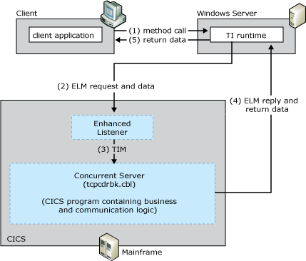

# TCP Enhanced Listener Message User Data
The TCP enhanced listener message (ELM) User Data model allows data and parameters to be passed directly between TI and the server TP.  
  
 The following figure summarizes the workflow occurring between the client, the enhanced CICS Listener, the Concurrent Server, and the mainframe transaction program. The numbers in parentheses indicate the approximate order in which events occur. A more detailed description of the events follows the figure.  
  
   
Summary workflow for the TCP ELM User Data programming model  
  
## TCP ELM User Data Programming Model  
 The TCP ELM User Data programming model works as follows:  
  
1. An application invokes a method in a TI .NET object.  
  
2. The TI runtime calls the TI proxy.  
  
3. The TI proxy:  
  
   1. Reads in the assembly and meta data created previously by the TI Designer.  
  
   2. Maps the .NET Framework data types to COBOL data types.  
  
      The TI proxy then:  
  
   3. Calls the conversion routines to convert the application data to mainframe COBOL types.  
  
   4. Builds the flattened data stream buffer that represents the COBOL declaration or copybook.  
  
   5. Passes the message to the TCP transport component.  
  
4. The TI TCP transport sends a connect request to the enhanced Listener using the Internet Protocol (IP) address of the mainframe computer and the port address of the Listener.  
  
5. The enhanced Listener accepts the connection request and tells TI run-time to send the ELM. The enhanced Listener then waits for the ELM.  
  
    The ELM is a formatted data record that identifies the server TP to be invoked by using its TRANID. The Listener TP is a special mainframe TP, whose main function is to receive server TP invocations sent by client applications running TCP/IP.  
  
6. TI run-time formats the ELM and sends it to the enhanced Listener. TI then bypasses the transport logic that waits for a ELM reply and immediately sends the application request data after the request header. TI then waits for the ELM reply.  
  
7. The enhanced Listener receives the 35 byte ELM, and then reads the contents of the ELM header. The enhanced Listener places the 35 bytes in the transaction initial message (TIM) but does not operate on its content.  
  
    The TIM describes the TCP/IP environment in which the server is running and contains the TCP/IP socket information the concurrent server uses to communicate with the TI TCP Transport and the client message header the concurrent server uses to customize its execution behavior. The header contains the name of the server program to be linked to.  
  
8. The enhanced Listener starts the concurrent server TP program (Mscmtics.cbl sample application) that is identified by the TRANID in the ELM using EXEC CICS Start.  
  
    Mscmtics.cbl is the Microsoft sample TP file that is used to pass data between TI and the server TP using the COMMAREA. The Mscmtics.cbl sample TP is developed by Microsoft and provided as part of the Host Integration Server software. It is located in the $\Microsoft Host Integration Server\SDK\Samples\Comti\ProgrammingSpecifics\Tcp. It must be compiled, linked, and installed on the mainframe computer prior to using this model.  
  
> [!NOTE]
>  If the standard Listener is unable to start the Concurrent Server, the Listener formats an error message and sends it back to the TI TCP Transport. Reasons the Listener might be unable to start include:  
  
-   rejected connection due to limited CICS resources (for example, exceeds the maximum number of CICS tasks or concurrent server tasks)  
  
-   invalid or disabled TRANID for the concurrent server  
  
-   invalid, disabled or unavailable Concurrent Server program associated with the transaction ID  
  
> [!NOTE]
>  The error message from the CICS listener is character based and always begins with the letters EZY. The length of the error message is variable, and the end of the message is determined by the socket closed by the CICS Listener.  The enhanced Listener calls the socket application protocol interface (API) in the host environment. After the enhanced Listener has issued the start command for the concurrent server transaction, the enhanced Listener is out of the application processing loop and is free to listen for another incoming request.  
  
1. After the concurrent server is running, it reads the transaction initial message (TIM) sent by the standard Listener.  
  
    The TIM describes the TCP/IP environment in which the server is running and contains the TCP/IP socket information the concurrent server uses to communicate with the TI TCP Transport and the client message header the concurrent server uses to customize its execution behavior.  
  
2. The concurrent server sends the TRM to TI and waits for the application request data.  
  
3. TI evaluates the TRM and passes the data directly to the concurrent server program (Mscmtics.cbl). TI also sends  socket shutdown, and then TI waits for the reply data.  
  
4. After the data is received, the server TP performs the business logic on the data. All business logic is defined in the server TP.  
  
5. The server TP prepares the reply data and then sends the response directly to the client.  
  
6. The concurrent server closes the socket  
  
7. The TI proxy receives the reply data and processes the reply. The TI proxy:  
  
   1. receives the message from the TCP transport component.  
  
   2. reads the message buffer  
  
      The TI proxy:  
  
   3. maps the COBOL data types to the .NET Framework data types  
  
   4. calls the conversion routines to convert the mainframe COBOL types to the application data  
  
8. The TI runtime sends the converted data back to the COM or .NET Framework application that invoked the method.  
  
   Host Integration Server includes sample code showing how to implement the TCP ELM User Data programming model. The sample code is located at \installation directory\SDK\Samples\AppInt. Start Microsoft Visual Studio, open the tutorial you want to use, and follow the instructions in the Readme.  
  
   For information about configuring the mainframe and writing server applications for TCP/IP, see TCP/IP V3R2 for MVS: CICS TCP/IP Socket Interface Guide (IBM Document #SC31-7131).  
  
## See Also  
 [Transaction Integrator Components](../core/transaction-integrator-components1.md)   
 [Transaction Request Messages](./transaction-request-messages2.md)   
 [Converting Data Types from Automation to OS/390 COBOL\]](./converting-data-types-from-automation-to-os-390-cobol]2.md)   
 [Converting Data Types from OS/390 COBOL to Automation](./converting-data-types-from-os-390-cobol-to-automation2.md)   
 [CICS Components](../core/cics-components1.md)   
 [TI Runtime](../core/ti-runtime2.md)   
 [Choosing the Appropriate Programming Model](../core/choosing-the-appropriate-programming-model1.md)   
 [Programming Models](../core/programming-models2.md)