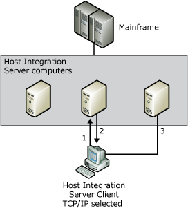

# TCP/IP Clients
The following figure shows how a TCP/IP client computer can connect to the mainframe.  
  
   
  
 A TCP/IP client computer uses the following procedure to connect to the mainframe:  
  
1. With TCP/IP, you can choose between two methods by which a client searches for [!INCLUDE[hisHostIntServNoVersion](../includes/hishostintservnoversion-md.md)] computers.  
  
   -   **Client locate servers by subdomain** means that the client locates the server through broadcasts in the local subdomain. Therefore, the client must be in the same physical network as the Host Integration Server computers, and must not be separated from the servers by a router.  
  
   -   **Client locates servers by name** means that the client searches for Host Integration Server computers by name or IP address, and therefore need not be on the same side of any routers as the Host Integration Server computers. When using a name (instead of an IP address) and there is a router separating the Host Integration Server computer and the client, the client computer requires a method of resolving a name to an IP address. A local LMHOSTS file or a Windows Internet Name Service (WINS) server may be used to perform this resolution.  
  
2. The Host Integration Server computer responds with a list of available Host Integration Server computers that are available to get a 3270 or APPC session with. This special connection is called the sponsor connection.  
  
3. Finally, the client attempt to connect to each Host Integration Server computer in the list until a server is found that can service the 3270 or APPC request.  
  
   Note that before attempting to establish communication involving Host Integration Server, you can use the TCP/IP utility called **ping** to verify that contact can be established between client and server. This can help you identify basic TCP/IP problems, such as difficulties with name resolution or with routers. For information about the **ping** utility, see the TCP/IP documentation.  
  
> [!NOTE]
>  Ensure that the logged-on user has sufficient user rights to access the Host Integration Server computer across the network. As with any other LAN connection, this is validated through the Windows Domain model.  
  
## In This Section  
 [TCP/IP Errors](../core/tcp-ip-errors1.md)  
  
## See Also  
 [Details about How Clients Use Protocols](../core/details-about-how-clients-use-protocols1.md)