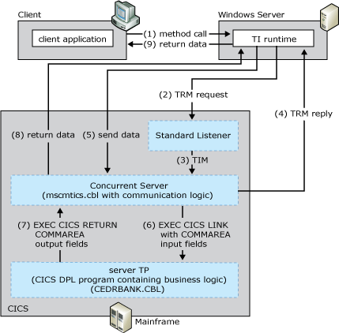

# TCP Transaction Request Message Link
The TCP transaction request message (TRM) Link model allows data and parameters to be passed between TI and the server TP through the COMMAREA. The model also allows a Concurrent Server to Link to a CICS DPL program. The standard Listener for TCP/IP uses two network exchanges to execute a single transaction program and requires the client to:  
  
- Send a Transaction Request Message (TRM) to the standard Listener.  
  
- Receive a TRM reply from the application program.  
  
- Send the application request data stream to the server transaction program.  
  
- Receive the application reply data from the server transaction program.  
  
  The TCP TRM Link model is based on the CICS Concurrent Server model. The TCP TRM Link model is a Microsoft variant that supports execution of DPL server application programs within the CICS environment and maintains compatibility with the CICS LU6.2 Link programming model.  
  
  The following figure summarizes the workflow occurring between the client, the standard CICS Listener, the Concurrent Server, and the mainframe transaction program. The numbers in parentheses indicate the approximate order in which events occur. A more detailed description of the events follows the figure.  
  
    
  Process by which the client starts the default Listener, which passes the call to the concurrent server, which then sends and receives data from the client, which the server then passes to the CICS DPL program for processing by the business logic  
  
## Summary Workflow for the TCP TRM Link Programming Model  
 The TCP TRM Link programming model works as follows:  
  
1. An application invokes a method in a TI component configured in either Component Services or the .NET Framework.  
  
2. The TI runtime calls the TI Automation proxy.  
  
3. If the application is a COM+ component, the TI Automation proxy:  
  
   1. Reads in the type library created previously by the TI Designer.  
  
   2. Maps the automation data types to COBOL data types.  
  
      If the application is a .NET Framework assembly, the TI Automation proxy:  
  
   3. Reads in the assembly and meta data created previously by the TI Designer.  
  
   4. Maps the .NET Framework data types to COBOL data types.  
  
      The TI Automation proxy then:  
  
   5. Calls the conversion routines to convert the application data to mainframe COBOL types.  
  
   6. Builds the flattened data stream buffer that represents the COBOL declaration or copybook.  
  
   7. passes the data stream to the TCP transport component.  
  
4. The TI TCP transport sends a connect request to the standard Listener using the Internet Protocol (IP) address of the mainframe computer and the port address of the Listener.  
  
5. The standard Listener accepts the connection request and tells TI runtime to send the TRM. The standard Listener then waits for the TRM.  
  
    The TRM is a formatted data record that identifies the server TP to be invoked by using its TRANID. The Listener TP is a special mainframe TP, whose main function is to receive server TP invocations sent by client applications running TCP/IP.  
  
    The TRANID of the IBM-provided, standard Listener TP is CSKL. The TP name of the Listener TP, as it appears in the CICS program control table (PCT) is EZACIC02.  
  
6. TI runtime formats either a standard or custom TRM and sends it to the standard Listener. TI runtime then waits for the TRM reply.  
  
7. The standard Listener receives the TRM, sends TI runtime a receive confirmation, and then reads the contents of the TRM. The Listener interprets the information in the TRM and extracts the transaction ID of the Concurrent Server program that is to service the request.  
  
8. The standard Listener starts the concurrent server TP program (Mscmtics.cbl sample application) that is identified by the TRANID in the TRM using EXEC CICS Start.  
  
    Mscmtics.cbl is the Microsoft sample TP file that is used to pass data between TI and the server TP using the COMMAREA. The Mscmtics.cbl sample TP is developed by Microsoft and provided as part of the [!INCLUDE[hisHostIntServNoVersion](../includes/hishostintservnoversion-md.md)] software. It is located in the $\Microsoft Host Integration Server\SDK\Samples\Comti\ProgrammingSpecifics\Tcp. The code must be compiled, linked, and installed on the mainframe computer prior to using this model.  
  
   > [!NOTE]
   >  If the standard Listener is unable to start the Concurrent Server, the Listener formats an error message and sends it back to the COMTI TCP Transport. Reasons the Listener might be unable to start include:  
   >   
   >  Rejected connection due to limited CICS resources (for example, exceeds the maximum number of CICS tasks or concurrent server tasks)  
   >   
   >  Invalid or disabled TRANID for the concurrent server  
   >   
   >  Invalid, disabled or unavailable Concurrent Server program associated with the transaction ID  
  
   > [!NOTE]
   >  The error message from the CICS listener is character based and always begins with the letters EZY. The length of the error message is variable, and the end of the message is determined by the socket closed by the CICS Listener.  The standard Listener calls the socket application protocol interface (API) in the host environment. The standard Listener cannot send the TRM Reply. The TRM Reply represents a synchronization process that allows time for the transaction program to be started prior to the application request data being sent by the client. This synchronization process is necessary due to internal CICS architectural consideration (there is no guarantee as to when a transaction program is started after the request is made).  
  
    After the standard CICS Listener has issued the start command for the concurrent server transaction, the standard Listener is no longer needed for application processing and is free to listen for another incoming request.  
  
9. After the concurrent server is running, it reads the transaction initial message (TIM) sent by the standard Listener.  
  
     The TIM describes the TCP/IP environment in which the server is running and contains the TCP/IP socket information the concurrent server uses to communicate with the COMTI TCP Transport and the client message header the concurrent server uses to customize its execution behavior. The header contains the name of the server program to be linked to.  
  
10. The Concurrent Server:  
  
    1. Formats the standard or custom TRM reply.  
  
    2. Sends a TRM reply to the TI TCP Transport to inform it that it can now send the application request data.  
  
    3. Issues a receive and waits for the application request data.  
  
       Sending of the TRM reply completes the 1st part of the standard Listener exchange sequence.  
  
11. TI runtime evaluates the TRM and passes the data to the Concurrent Server program through the CICS COMMAREA by using a standard EXEC CICS Link call. TI runtime also sends a  socket (that is, 2 byte) shutdown and then waits for the reply data.  
  
12. After the Concurrent Server receives the application request data it links to the serving application program that was specified in the TRMs client message header. The CICS EXEC CICS LINK command is used to start the real server application. The Link command passes the application data received from the COMTI TCP Transport to the common area of memory (COMMAREA) and performs the business logic on the data. All business logic is defined in the server TP.  
  
13. After the server application program has finished processing the request and formulating the reply, it issues an EXEC CICS RETURN command to give control back to the Concurrent Server (mscmtics.cbl) program. The server TP prepares the reply data along with a standard or custom TRM, accepts the data from the COMMAREA, and then sends the application reply data back to the TI TCP Transport through the COMMAREA. Completing the processing of the application data signals the end of the 2nd exchange sequence.  
  
14. The concurrent server closes the socket.  
  
15. The TI Automation proxy receives the reply data and processes the reply. The TI Automation proxy:  
  
    1. Receives the message from the TCP transport component.  
  
    2. Reads the message buffer.  
  
       If the application is a COM+ component, the TI Automation proxy:  
  
    3. Maps the COBOL data types to the automation data.  
  
    4. Calls the conversion routines to convert the mainframe COBOL types to the application data.  
  
       If the application is a .NET Framework assembly, the TI Automation proxy:  
  
    5. Maps the COBOL data types to the .NET Framework data types.  
  
    6. Calls the conversion routines to convert the mainframe COBOL types to the application data.  
  
16. The TI runtime sends the converted data back to the COM or .NET Framework application that invoked the method.  
  
    To implement this model, you must provide TI with an IP address, a port number, and a CICS program name to execute the application passed by the concurrent server program (Mscmtics.cbl). The model requires the installation, within CICS, of the IBM-supplied default Listener (EZACIC02). The CICS IBM default Listener uses IBM-provided default settings.  
  
    [!INCLUDE[hisHostIntServNoVersion](../includes/hishostintservnoversion-md.md)] includes sample code showing how to implement the TCP TRM Link programming model. The sample code is located at **\\**<em>installation directory</em>**\SDK\Samples\AppInt**. Start Microsoft Visual Studio, open the tutorial of your choice, and follow the instructions in the **Readme**.  
  
    For information about configuring the mainframe and writing server applications for TCP/IP, see TCP/IP V3R2 for MVS: CICS TCP/IP Socket Interface Guide (IBM Document #SC31-7131).  
  
## See Also  
 [Transaction Integrator Components](../core/transaction-integrator-components1.md)   
 [Transaction Request Messages](./transaction-request-messages2.md)   
 [Converting Data Types from Automation to OS/390 COBOL\]](./converting-data-types-from-automation-to-os-390-cobol]2.md)   
 [Converting Data Types from OS/390 COBOL to Automation](./converting-data-types-from-os-390-cobol-to-automation2.md)   
 [CICS Components](../core/cics-components1.md)   
 [Choosing the Appropriate Programming Model](../core/choosing-the-appropriate-programming-model1.md)   
 [Programming Models](../core/programming-models2.md)