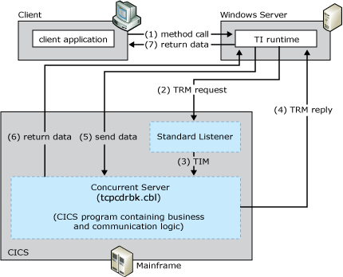

# TCP Transaction Request Message User Data
The TCP transaction request message (TRM) User Data programming model allows data and parameters to be exchanged directly between TI and the host TP. The TCP TRM User Data model is based on the CICS Concurrent Server model. The standard Listener uses two network exchanges to execute a single transaction program and requires the client to:  
  
- Send a Transaction Request Message (TRM) to the standard Listener  
  
- Receive a TRM reply from the application program  
  
- Send the application request data stream to the server transaction program  
  
  Receive the application reply data from the server transaction program  
  
  The following figure summarizes the workflow occurring between the client, the standard CICS Listener, and the Concurrent Server. The numbers in parentheses indicate the approximate order in which events occur. A more detailed description of the events follows the figure.  
  
    
  Process by which the client starts the default Listener, which passes the call to the concurrent server, which then sends and receives data from the client  
  
## Summary Workflow Diagram for the TCP TRM User Data Programming Model  
 The TCP TRM User Data programming model works as follows:  
  
1. An application invokes a method in a TI .NET object configured in either Component Services or the .NET Framework.  
  
2. The TI runtime calls the TI proxy.  
  
3. The TI proxy:  
  
   1. Reads in the assembly and meta data created previously by the TI Designer.  
  
   2. Maps the .NET Framework data types to COBOL data types.  
  
      The TI proxy then:  
  
   3. Calls the conversion routines to convert the application data to mainframe COBOL types.  
  
   4. Builds the flattened data stream buffer that represents the COBOL declaration or copybook.  
  
   5. Passes the message to the TCP transport component.  
  
4. The TI TCP transport sends a connect request to the standard Listener using the Internet Protocol (IP) address of the mainframe computer and the port address of the Listener.  
  
5. The standard Listener accepts the connection request and tells TI runtime to send the TRM. The standard Listener then waits for the TRM.  
  
    The TRM is a formatted data record that identifies the server TP to be invoked by using its TRANID. The CICS Listener TP is a special mainframe TP, whose main function is to receive server TP invocations sent by client applications running TCP/IP.  
  
    The TRANID of the IBM-provided, standard Listener TP is CSKL. The TP name of the Listener TP as it appears in the program control table (PCT) is EZACIC02.  
  
6. TI runtime formats the TRM and sends it to the standard Listener. TI waits for the TRM reply.  
  
7. The standard Listener receives the TRM, sends TI runtime a receive confirmation, and then reads the contents of the TRM. The Listener interprets the information in the TRM and extracts the transaction ID of the Concurrent Server program that is to service the request.  
  
8. The standard Listener starts the concurrent server TP program that is identified by the TRANID in the TRM (Mscmtics.cbl sample application) using EXEC CICS Start.  
  
    Mscmtics.cbl is the Microsoft sample TP file that is used to pass data between TI and the server TP using the COMMAREA. The Mscmtics.cbl sample TP is developed by Microsoft and provided as part of the [!INCLUDE[hisHostIntServNoVersion](../includes/hishostintservnoversion-md.md)] software. It is located in the $\Microsoft Host Integration Server\SDK\Samples\Comti\ProgrammingSpecifics\Tcp. It must be compiled, linked, and installed on the mainframe computer prior to using this model.  
  
> [!NOTE]
>  If the standard Listener is unable to start the Concurrent Server, the Listener formats an error message and sends it back to the TI TCP Transport. Reasons the Listener might be unable to start include:  
  
-   rejected connection due to limited CICS resources (for example, exceeds the maximum number of CICS tasks or concurrent server tasks)  
  
-   invalid or disabled TRANID for the concurrent server  
  
-   invalid, disabled or unavailable Concurrent Server program associated with the transaction ID  
  
> [!NOTE]
>  The error message from the CICS listener is character based and always begins with the letters EZY. The length of the error message is variable, and the end of the message is determined by the socket closed by the CICS Listener.  
  
1. The standard Listener calls the socket application protocol interface (API) in the host environment. The standard Listener cannot send the TRM Reply. The TRM Reply represents a synchronization process that allows time for the transaction program to be started prior to the application request data being sent by the client. This synchronization process is necessary due to internal CICS architectural consideration (there is no guarantee as to when a transaction program is started after the request is made).  
  
    After the standard CICS Listener has issued the start command for the concurrent server transaction, the standard Listener is out of the application processing loop and is free to listen for another incoming request.  
  
2. After the concurrent server is running, it reads the transaction initial message (TIM) sent by the standard Listener.  
  
    The TIM describes the TCP/IP environment in which the server is running and contains the TCP/IP socket information the concurrent server uses to communicate with the COMTI TCP Transport and the client message header the concurrent server uses to customize its execution behavior.  
  
3. The Concurrent Server:  
  
   1. Formats the TRM reply.  
  
   2. Sends a TRM Reply to the TI TCP Transport to inform it that it can now send the application request data.  
  
   3. Issues a receive and waits for the application request data.  
  
      Sending of the TRM Reply completes the 1st part of the Standard Listener exchange sequence.  
  
4. TI evaluates the TRM and passes the data to the Concurrent Server. TI also sends  socket shutdown, and then TI waits for the reply data.  
  
5. After the Concurrent Server receives the application request data, the server  performs the business logic on the data.  
  
6. After the server has finished processing the request and formulating the reply, prepares the reply data and then sends the response directly to the client. Completing the processing of the application data signals the end of the 2nd exchange sequence.  
  
7. The concurrent server closes the socket.  
  
8. The TI proxy receives the reply data and processes the reply. The TI proxy:  
  
   1. Receives the message from the TCP transport component.  
  
   2. Reads the message buffer.  
  
      The TI proxy:  
  
   3. Maps the COBOL data types to the .NET Framework data types.  
  
   4. Calls the conversion routines to convert the mainframe COBOL types to the application data.  
  
9. The TI runtime sends the converted data back to the .NET Framework application that invoked the method.  
  
   To implement this model, you must provide TI with an IP address, a port number, and a CICS program name to execute the application passed by the concurrent server program (Mscmtics.cbl). The model requires the installation, within CICS, of the IBM-supplied default Listener (EZACIC02). The CICS IBM default Listener uses IBM-provided default settings.  
  
   [!INCLUDE[hisHostIntServNoVersion](../includes/hishostintservnoversion-md.md)] includes sample code showing how to implement the TCP TRM Link programming model. The sample code is located at **\\**<em>installation directory</em>**\SDK\Samples\AppInt**. Start Visual Studio, open either the tutorial you want to use, and follow the instructions in the **Readme**.  
  
   For information about configuring the mainframe and writing server applications for TCP/IP, see TCP/IP V3R2 for MVS: CICS TCP/IP Socket Interface Guide (IBM Document #SC31-7131).  
  
## See Also  
 [Transaction Integrator Components](../core/transaction-integrator-components1.md)   
 [Transaction Request Messages](./transaction-request-messages2.md)   
 [Converting Data Types from Automation to OS/390 COBOL\]](./converting-data-types-from-automation-to-os-390-cobol]2.md)   
 [Converting Data Types from OS/390 COBOL to Automation](./converting-data-types-from-os-390-cobol-to-automation2.md)   
 [CICS Components](../core/cics-components1.md)   
 [TI Runtime](../core/ti-runtime2.md)   
 [Choosing the Appropriate Programming Model](../core/choosing-the-appropriate-programming-model1.md)   
 [Programming Models](../core/programming-models2.md)