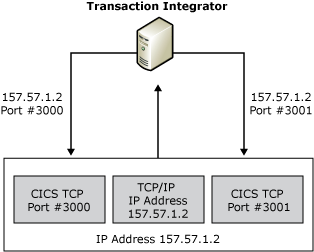

# TI TCP/IP Load Balancing
Transaction Integrator (TI) can load balance TCP/IP ports when you have configured TI for CICS and IMS TCP/IP remote environments. To enable load balancing, supply multiple TCP port numbers when you create the remote environment; this enables connections to redundant CICS or IMS regions on a single host system. The following figure shows the TI TCP port load balancing solution.  
  
   
Transaction Integrator receiving a TCP/IP address and sending it to CICS ports 3000 and 3001  
  
 The first TCP port is used by the first transaction and will take turns going through all the configured ports for each transaction that is invoked.  
  
 Additional host configuration details for CICS and IMS are included in the following sections.  
  
## CICS TCP/IP Platform Requirements  
 The version dependencies for CICS include the following:  
  
-   TCP/IP version 3R2  
  
-   CICS version 3.3 or later  
  
## Connections to CICS Using TCP/IP  
 CICS uses the IBM-supplied Concurrent Listener (program EZACIC02, transaction ID CSKL) to establish an interaction with TCP/IP. The Listener runs as a CICS task to help facilitate the connection process. The Listener transaction starts automatically when CICS TCP/IP is started and enabled. When the Listener starts, it obtains a socket on which it can listen for connection requests from TCP/IP. The Listener binds this socket to a specified port, and then it waits for a client request on that port. TCP/IP maintains a relationship of a port number to a CICS job. When a client makes a request on a port associated with CICS, TCP/IP forwards the connection request to the Listener in that CICS job.  
  
## TCP/IP-to-CICS Configuration  
 A TCP/IP port number is associated with a CICS region in the TCP/IP profile data set (hlq.PROFILE.TCPIP). The port statement is used to define this relationship. An example of a port statement that associates port 3000 with CICS job CICSRG follows:  
  
```  
3000 TCP CICSRG  
  
```  
  
## CICS to TCP/IP Configuration  
 The following sample host definition shows configuration parameters for CICS-to-TCP using the EZAC transaction. The items in bold type are CICS transactions.  
  
```  
  
ENTER ONE OF THE FOLLOWING  
  
CICS            ===> yes                  Enter Yes|No  
LISTENER     ===>                        Enter Yes|No  
  
ENTER ALL FIELDS  
  
APPLID       ===> CICSRG             APPLID of CICS System  
  
EZAC,DEFINE,CICS  
OVERTYPE TO ENTER  
  
APPLID       ===> CICSRG            APPLID of CICS System  
TCPADDR   ===> TCPIP                Name of TCP Address Space  
NTASKS     ===> 020                   Number of Reusable Tasks  
DPRTY       ===> 000                   DPRTY value for ATTACH  
CACHMIN   ===> 015                   Minimum Refresh Time for Cache  
CACHMAX   ===> 030                  Maximum Refresh Time for Cache  
CACHRES   ===> 010                  Maximum number of Resolvers  
ERRORTD   ===> CSMT               TD Queue for Error Messages  
  
```  
  
 The following sample host definition shows configuration parameters for the CICS Concurrent Listener using the EZAC transaction. The items in bold type are CICS transactions.  
  
```  
EZAC,DEFINE  
ENTER ONE OF THE FOLLOWING  
  
CICS         ===>                      Enter Yes|No  
LISTENER     ===> yes           Enter Yes|No  
  
ENTER ALL FIELDS  
  
APPLID       ===> CICSRG             APPLID of CICS System  
NAME         ===> xyz                  TRANSACTION NAME OF LISTENER  
  
EZAC,DEFINE,LISTENER  
OVERTYPE TO ENTER  
  
APPLID          ===> CICSRG             APPLID of CICS System  
TRANID         ===> XYZ                   Transaction Name of Listener  
PORT             ===> 03000                Port Number of Listener  
IMMEDIATE    ===> YES                   Immediate Startup   Yes|No  
BACKLOG      ===> 010                    Backlog Value for Listener  
NUMSOCK     ===> 050                    Number of Sockets in Listener  
MINMSGL      ===> 004                    Minimum Message Length  
ACCTIME       ===> 060                    Timeout Value for ACCEPT  
GIVTIME       ===> 030                    Timeout Value for GIVESOCKET  
REATIME       ===> 000                    Timeout Value for READ  
FASTRD        ===> YES                    Read Immediately    Yes|No  
TRANTRN      ===> YES                   Translate TRNID     Yes|No  
TRANUSR      ===> YES                   Translate User Data Yes|No  
SECEXIT       ===>                          Name of Security Exit  
  
```  
  
## IMS TCP/IP Platform Requirements  
 The version dependencies for IMS include the following:  
  
-   TCP/IP version 3R2  
  
-   IMS version 4 or later  
  
## Connections to IMS using TCP/IP  
 IMS uses a Listener to establish an interaction with TCP/IP. A Listener in an IMS Batch Message Processing (BMP) helps facilitate the connection process. When the Listener starts, it obtains a socket on which it can listen for connection requests from TCP/IP. The Listener binds this socket to a specified port, and then waits for a client request on that port.  
  
 TCP/IP maintains a relationship of a port number to an IMS Listener BMP. When a client makes a request on a port associated with IMS, TCP/IP forwards the connection request to the Listener in that BMP.  
  
## TCP/IP to IMS Configuration  
 A TCP/IP port number is associated with an IMS Batch Processing Region (BPR) in the TCP/IP profile data set (hlq.PROFILE.TCPIP). The port statement is used to define this relationship. An example of a port statement that associates port 3000 with IMS batch region with a job name of WNWIBPR1 is:  
  
 3000 TCP WNWIBPR1  
  
## IMS to TCP/IP Configuration  
 An IMS MPP is started specifying the program name IMS IBM supplied Listener program (EZAIMSLN). This Listener reads a configuration file identified by the DD statement **LSTNCFG**. This configuration data set contains one or more the following startup parameter sets (one set for each transaction defined for least one CR):  
  
- **TCPIP** statement  
  
- **LISTENER** statement  
  
- **TRANSACTION** statement  
  
  The **TCPIP** statement is used to identify the job name for the TCP/IP address space that will manage connection for this listener.  
  
  The **LISTENER** statement is used to specify the port number that this Listener will be using. This statement also specifies other port-related parameters such as backlog, time out values, and so on.  
  
  The **TRANSACTION** statement defines a list of transaction that this Listener can start. In addition, this statement defines whether the implicit or explicit connection mode is used.  
  
  The Listener uses these three parameter statements to inform the Listener which TCP/IP port to use and which transactions can be accessed through TCP/IP.  
  
  Here is a sample of an IMS-to-TCP/IP host definition:  
  
```  
TCPIP      ADDRSPC=WNWTCP31  
LISTENER   PORT=4000 BACKLOG=50  
TRANSACTION   NAME=TRANIMPL TYPE=IMPLICIT  
TRANSACTION   NAME=TRANEXPL TYPE=EXPLICIT  
  
```  
  
## See Also  
 [Load Balancing and Hot Backup](../core/load-balancing-and-hot-backup2.md)