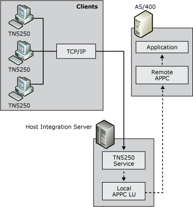

# TN5250 Access
TN5250 is a protocol that allows users to access IBM System i systems over a TCP/IP network using an appropriate TN5250 client terminal emulator. The TN5250 service provided with Host Integration Server enables any TN5250 client to connect to the IBM System i by means of Host Integration Server without installing or configuring TCP/IP on the IBM System i. Full 5250 terminal emulation functions are supported by the service, as well as hot backup and security features similar to those provided with the TN3270 service.  
  
   
Diagram showing TN5250 service  
  
 To provide TN5250 access, you need to define local and remote APPC LUs, a mode, an IBM System i user name and password, a terminal type, and, optionally, an IP address and subnet mask.  
  
## See Also  
 [APPC Applications](../core/appc-applications2.md)
