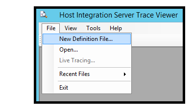
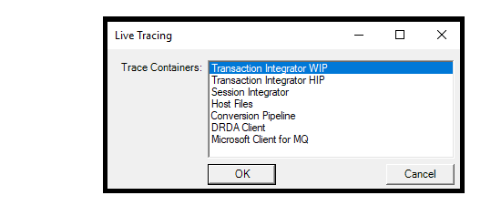
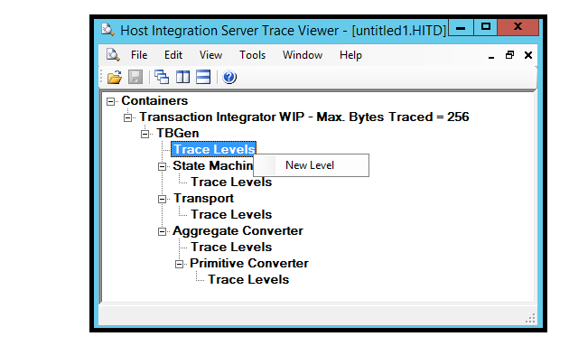
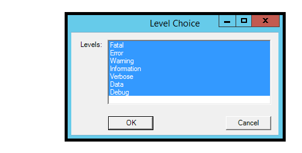
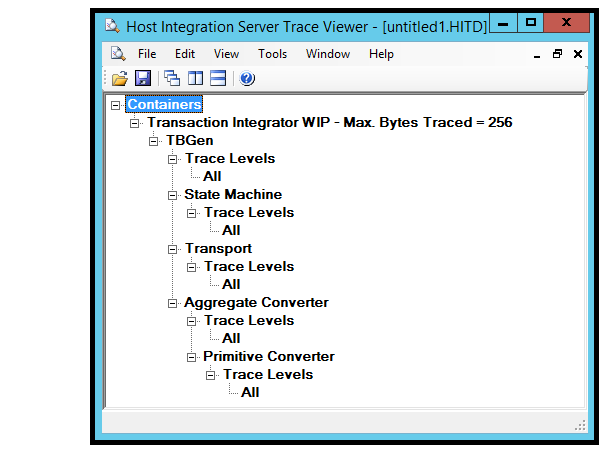
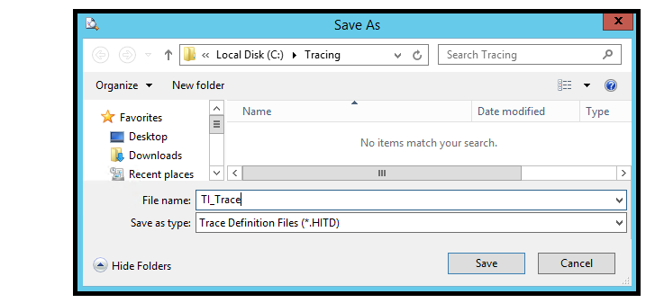

# Tracing and Debugging
Transaction Integrator (TI) provides detailed tracing of both Windows Initiated Processing (WIP) calls and Host Initiated Processing (HIP) calls. This tracing is done via enabling tracing in the app config file along with a Host Integration Trace Definition file (.hitd) that describes what should be traced. Tracing can be turned on and off through the hitd file. Tracing may also be turned on and off through the app config file, however, the TI process must be restarted for the new configuration to take affect because the app config file is only read when the TI process is started.

The following instructions show how to set up tracing where the trace files will be located in a C:\Tracing folder.  A different folder can be used if necessary - it is important that the account running the TI Process has read/write access to the trace folder.

1. Create the tracing folder,  C:\Tracing

2. Create a Host Integration Trace Definition file (HITD)
3. Start the Trace Viewer (HIS must be installed): Start - Run – histraceviewer
4. From the File menu select New Definition File.
   
5. Select Transaction Integrator WIP:
   
6. Tracing size and Selections: Trace Levels can be set for each component. If a Trace level is set at a higher component, then that trace level also applies to subordinate components.

     * Right Click “Trace Levels” and select “New Level".
   
     * Select one or more levels and click OK.
   
     * Selecting all options will result in “ALL” being reflected after clicking OK.
   
     * Save the new HITD file as TI_Trace in the C:\Tracing directory. Close the Trace Viewer.
         
7. Update the application config file with Trace configuration information.

      For Windows Initiated Processing (WIP) the app.config in the TI .Net project can be modified with the trace configuration information and will be included in the \<appname\>.exe.config file when the application is compiled.  If the application has already been compiled, the \<appname\>.exe.config file can be modified directly with this information.

      If the BizTalk Adapter for Host Applications (BAHA) is being used within BizTalk, the config file that must be modified is the BizTalk Server exe config file for the BizTalk Host that is selected for the BAHA port within the BizTalk application. The config file is located at \%BTSINSTALLPATH\% and has a name of either BTSNTSvc.exe.config or BTSNTSvc64.exe.config depending upon whether it is a 32-bit or 64-bit host process the BAHA port is using.

      If Host Initiated Processing (HIP) is being used, it is the HIPService.exe.config file that must be modified. This file is located at \%SNAROOT\%.

      Add the following section statement inside the configSections element. Add a configSections element if one does not exist 

      The \<configSections\> statement must be immediately after \<configuration\> and before the \<startup\> section.

      For **HIS 2016** enter the following line within the configSections element:

      ```
      <configSections>
         <section name="hostIntegration.tracing" type="Microsoft.HostIntegration.ConfigurationSectionHandlers.Tracing.TracingConfigurationSectionHandler, Microsoft.HostIntegration.ConfigurationSectionHandlers, Version=10.0.1000.0, Culture=neutral, PublicKeyToken=31bf3856ad364e35" />
      </configSections>
      ```

      For **HIS 2013** enter the following line within the configSections element (the difference is the version change):
      ```
      <configSections>
         <section name="hostIntegration.tracing" type="Microsoft.HostIntegration.ConfigurationSectionHandlers.Tracing.TracingConfigurationSectionHandler, Microsoft.HostIntegration.ConfigurationSectionHandlers, Version=9.0.1000.0, Culture=neutral, PublicKeyToken=31bf3856ad364e35" />
      </configSections>
      ```

      Add the following basic tracing configuration elements to the section at the end of the configuration section just before the \<\/configuration\> section closing statement:
      ```
      <hostIntegration.tracing xmlns="http://schemas.microsoft.com/HIS/Tracing/2013">
            <traceOptions traceDefinitionFile="C:\Tracing\TI_Trace.hitd"
                          writeTraceFile="true"
                          fileNamePreamble="TI_Tracing"
                          traceFileFolder="C:\Tracing\" />
            </hostIntegration.tracing>
      ```
8. Execute the application to begin tracing. If changes were made to the application config file, then the process the TI Runtime is using must be restarted to enable tracing. If using BizTalk, the host instance must be restarted. If using IIS then the website must be restarted. If executing a .Net exe, then that program must be restarted.

   * Look in the C:\Tracing folder to see one or more HITF (Host Integration Trace File) files.  The name of the file will be TI_Tracing_\<process id number\>_\<date and time\>.hitf.  For example:

         TI_TRACING_6076_AUG_29_2017_13_00_52_421.HITF

   * Double-click the HITF file to open it in the Trace Viewer and examine what has been traced. If the TI process is still running some of the trace information may be in the buffer, quitting the application or running another TI call within the application will flush the buffer to see the entire trace of the first TI call.
     ```
         TBGen invoke entered for Class: BankingCicsElmLink.Accounts
         Non-Persistent
         Attempting to acquire library reader and load HIS object assembly
         Method: GetBalance
         Using configured RE for this object
         Remote Environment: ELM Link RE
         Aggregate Converter: Microsoft.HostIntegration.TI.AggregateConverter, Microsoft.HostIntegration.TI.AggregateConverter, Version=10.0.1000.0, Culture=neutral, PublicKeyToken=31bf3856ad364e35
         Primitive Converter: Microsoft.HostIntegration.Common.BasePrimitiveConverter, Microsoft.HostIntegration.Common.BasePrimitiveConverter, Version=10.0.1000.0, Culture=neutral, PublicKeyToken=31bf3856ad364e35
         Transport: Microsoft.HostIntegration.TI.ELMTransport, Microsoft.HostIntegration.TI.ELMTransport, Version=10.0.1000.0, Culture=neutral, PublicKeyToken=31bf3856ad364e35
         State Machine: Microsoft.HostIntegration.TI.GenericLinkStateMachine, Microsoft.HostIntegration.TI.GenericLinkStateMachine, Version=10.0.1000.0, Culture=neutral, PublicKeyToken=31bf3856ad364e35
         Invoking the state machine
         Generic Link state machine entered for method: GetBalance
         ELM Transport Initialized, Link: True, Codepage: 37
         Header length: 35
         Header Length: 35, Trailer Length: 0
         Non-Persistent
     ```
9. Turning Tracing off
      * Open the TI_Trace.hitd file in the Trace Viewer and remove the Trace levels.  When the hitd file is saved tracing will dynamically be turned off. There is no need to restart the TI application.

## Sample application config files for various scenarios
* Sample for a .Net WIP Application Program

```
      <?xml version="1.0"?>
      <configuration>
        <configSections>
          <section name="hostIntegration.ti.wip" type="Microsoft.HostIntegration.ConfigurationSectionHandlers.Ti.Wip.WipConfigurationSectionHandler, Microsoft.HostIntegration.ConfigurationSectionHandlers, Version=10.0.1000.0, Culture=neutral, PublicKeyToken=31bf3856ad364e35" />
          <section name="hostIntegration.tracing" type="Microsoft.HostIntegration.ConfigurationSectionHandlers.Tracing.TracingConfigurationSectionHandler, Microsoft.HostIntegration.ConfigurationSectionHandlers, Version=10.0.1000.0, Culture=neutral, PublicKeyToken=31bf3856ad364e35" />
        </configSections>

        <hostIntegration.ti.wip xmlns="http://schemas.microsoft.com/his/Config/TiWip/2013">
          <readOrder appConfig="first" cache="unused" registry="unused"/>
          <remoteEnvironments>
            <remoteEnvironment isDefault="true" name="ELM Link RE" timeout="5" codePage="37">
              <elmLink ipAddress="localhost" ports="7511" requestHeaderFormat="Microsoft"/>
            </remoteEnvironment>
          </remoteEnvironments>
        </hostIntegration.ti.wip>

        <startup>
          <supportedRuntime version="v4.0" sku=".NETFramework,Version=v4.6"/>
        </startup>

        <hostIntegration.tracing xmlns="http://schemas.microsoft.com/his/Tracing/2013">
          <traceOptions traceDefinitionFile="C:\Tracing\TI_Trace.hitd"
                        writeTraceFile="true"
                        fileNamePreamble="TI_Tracing"
                        traceFileFolder="C:\Tracing\" />
        </hostIntegration.tracing>
      </configuration>
```
* Sample for a BizTalk Application using the BizTalk Adapter for Host Applications - %BTSINSTALLPATH%\BTSNTSvc.exe.config or %BTSINSTALLPATH%\BTSNTSvc64.exe.config file:
  ```
  Here is my text
  ```
* Sample for an IIS application using the TI runtime
  ```
  Here is my text
  ```
* Sample for a TI Host Initiated Processing (HIP) application - %SNAROOT%\HIPService.exe.config file:
  ```
  Here is my text
  ```

## See Also  
 [SNA Trace Utility](../core/sna-trace-utility1.md) - The SNA Trace utility can help if the TI Object is using APPC through a Host Integration Server Gateway. This utility will capture the APPC traffic to and from the host. If the TI Object is communicating directly via TCP/IP with the host system, this utility will not help.