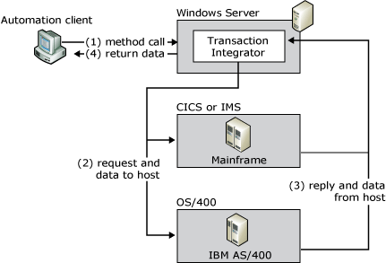

# Transaction Integrator Architecture
Transaction Integrator (TI) integrates the IBM Customer Information Control System (CICS), Information Management System (IMS) transaction programs (TP), and OS/400 applications with the .NET Framework by doing the following:  
  
- Creating interfaces to the CICS, IMS, and OS/400 transaction programs.  
  
- Invoking those transactions on the mainframe or midrange computer (also called the host computer) from a Microsoft Windows–based .NET application.  
  
  The primary function of TI is to manage the process and data conversions necessary to allow input data to be provided to the host TPs from a .NET Framework application and to send any output data generated from the TP to the Windows-based application. TI provides data type conversion, tabular data definition, and code page translation. The following figure shows an overview of the role that TI plays in the communications between the application and the host.  
  
    
  TI provides the data conversions between a Windows-based application and a host  
  
  An example of this type of distributed application is reading a DB2 database on the mainframe to update data in a SQL Server database on Microsoft Windows Server.  
  
  Because all TI processing is done on the Windows Server platform, no TI-related executable code (or footprint) is required on the mainframe or midrange computer. TI uses SNA (APPC/LU 6.2) and TCP/IP standard communication protocols for all communications between Windows and the host computer. You use TI Designer from within Visual Studio to build TI components. The configuration for connectivity to the host computer is done within the config file for the TI application. There is a TI Configuration Tool that aids in creating the config file entries.
  
## In This Section  
 [Online Transaction Processing](../core/online-transaction-processing2.md)  
  
 [Transaction Integrator Basic Functions](../core/transaction-integrator-basic-functions1.md)  
  
 [Transaction Integrator Components](../core/transaction-integrator-components1.md)  
  
 [Programming Models](../core/programming-models2.md)  
  
 [Host-Initiated Processing](../core/host-initiated-processing2.md)  
  
 [Windows-Initiated Processing](../core/windows-initiated-processing2.md)  
  
## See Also  
 [Application Integration (Planning)](../core/application-integration-planning-2.md)