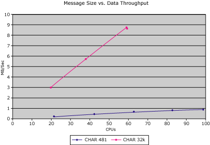

# Transaction Size vs. Data Throughput
As a result of the transaction throughput test shown in [Transaction Size vs. Transaction Throughput](../core/transaction-size-vs-transaction-throughput.md), the question of what the best message size for these transactions arises. We captured the actual user data transferred with these transactions and looked at the MB/sec throughput versus message size. The following figure shows that if the data throughput is the objective of optimization, the larger the message size, the higher the throughput. Additional considerations can influence the selections of the message size, such as the maximum frame size on the LAN or WAN. For example, Ethernet 802.2 frames can fit 1484 bytes of user data per frame; token-ring can go up to 8186 bytes.  
  
   
Chart displaying megabytes per second on the vertical axis and percent CPU on the horizontal axis  
  
## See Also  
 [Transaction Size vs. Transaction Throughput](../core/transaction-size-vs-transaction-throughput.md)   
 [Transaction Integrator Performance Guide](../core/transaction-integrator-performance-guide.md)