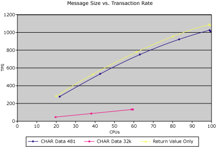

# Transaction Size vs. Transaction Throughput
When looking at the transactions per second (TPS) rates that the server might be capable of sustaining, you must consider the amount of data moved and processed for each transaction. It is generally understood that the more data that you transfer for each transaction, the fewer TPS you can push through. For Transaction Integrator (TI), this also holds true. The following figure shows the rate at which the TPS decrease as transaction sizes increase on the Quad Xeon 400 test server.  
  
   
Chart displaying transactions per second on the vertical axis and percent CPU on the horizontal axis  
  
 The best TPS rate is produced by the test transaction, which returns only 1 byte of data. This return value only sets the high bar to 1093 TPS. The Char481 (simple application screen) can maintain close to the maximum possible rate. The data transfer test of 32k, which moves 64000 bytes of data per transaction, cannot maintain the same TPS rate as the others. In this case, the latencies on the LAN, memory allocations, and copies begin to really show.  
  
## In This Section  
 [Transaction Size vs. Data Throughput](../core/transaction-size-vs-data-throughput2.md)  
  
## See Also  
 [Transaction Integrator Performance Guide](../core/transaction-integrator-performance-guide1.md)
