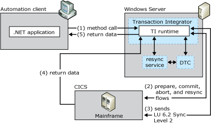

# Transactional Data Flows That Support Bounded Recordsets
This data flow model does not support unbounded recordsets. (An unbounded recordset has no set number of rows.)  
  
 The following figure shows what happens when a TI component participates in a COM+ transaction (a DTC-coordinated two-phase commit [2PC] exchange). TI uses LU 6.2 Sync Level 2 to manage the transaction. This capability applies to CICS and to IMS version 6.0 with Resource Recovery Services (RRS).  
  
   
Transaction Integrator sending and receiving a two-phase commit exchange from a mainframe via LU 6.2  
  
## TI sending and receiving a two-phase commit  
 This transactional model does not support unbounded recordsets. (An unbounded recordset has no set maximum number of rows.) The transactional model is supported only by the LU 6.2 protocol, not the TCP/IP protocol. Therefore this model supports the following server models only:  
  
- CICS LU6.2 Link  
  
- CICS LU6.2 User Data  
  
- IMS LU6.2  
  
  Microsoft Distributed Transaction Coordinator (DTC) works with the TI run-time environment and with the SNA LU 6.2 Resync TP service to provide the necessary 2PC flows as well as transaction log synchronization and recovery services. TI Automation clients can remain completely uninvolved in transaction commit or rollback decisions, or they can participate as shown in the following Visual Basic code. TI Automation clients are never aware of, nor involved in, transaction recovery. The following code sample is for a Visual Basic client that is involved in transaction control.  
  
```  
'Get object context reference  
Set ctxObject = GetObjectContext()  
'Create object instance for an example ProgID  
Set obj = ctxObject.CreateInstance ("A.B.1")  
'Invoke a method on the object with some parameters  
ret = obj.YourMethod(c,d,e)  
Do any other work that is part of this transaction  
'If application finds all is well, then commit, otherwise roll back  
If<something is not OK> Then  
   ctxObject.SetAbort  
Else  
   ctxObject.SetComplete  
End if  
  
```  
  
 If a client remains uninvolved in transaction control, the TI run-time environment automatically commits transactions that have no run-time environment failures and automatically rolls back those transactions that have failures. The TI run-time environment, however, cannot detect or react to application-specific conditions that require a transaction to initiate a rollback. These must be handled by the client application. For example, an "out of cash" situation in an automated teller machine must be handled by the client application.  
  
## See Also  
 [Supported Data Flow Models](../core/supported-data-flow-models1.md)