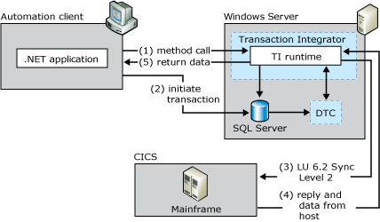

# Two-Phase Commit
A given business logic operation can involve multiple programs running on multiple computers. In this design, the transaction is not considered complete unless all of the programs involved complete their executions successfully. For these programs to verify that all other programs that are part of the transaction have completed their transactions, they must employ the two-phase commit (2PC) protocol.  
  
 The term transaction (or any of its derivatives, such as transactional), might be misleading. In many cases, the term transaction describes a single program executing on a mainframe computer that does not use the 2PC protocol. In other cases, however, it is used to denote an operation that is carried out by multiple programs on multiple computers that are using the 2PC protocol.  
  
 The 2PC protocol is so named because it employs the following two phases prior to committing the operation performed:  
  
-   Phase 1—Prepare. In this phase, each of the programs involved in the transaction sends a message to the TP Manager, such as Microsoft Distributed Transaction Coordinator (MS DTC), informing the TP Manager that it is ready to and capable of performing its part of the operation. This phase is also known as prepare because the programs are prepared either to commit the changes or rollback the changes. If the TP Manager receives confirmation from each of the programs involved, it proceeds to phase 2.  
  
-   Phase 2—Commit or Rollback. In this phase, the TP Manager instructs each of the programs to commit or rollback all of the changes that were requested as part of the transaction. A properly executed rollback should return the system to its original state.  
  
> [!NOTE]
>  The state between phase 1 and phase 2 is known as the in-doubt state. Developers using .NET in their applications can decide which parts of the application require access to a TP and which parts do not. TI extends this choice to the mainframe, as well, by handling calls that require transactions and calls that do not. For applications that require full integration between Windows-based two-phase commit and mainframe-based Sync Level 2 transactions, TI provides all the necessary functionality. TI does this without requiring you to change the client application, without placing executable code on the mainframe, and with little or no change to the mainframe TPs. The client application does not need to distinguish between the TI component and any other component reference.  
  
 The following figure shows how a Windows-based client application implicitly uses the Microsoft Distributed Transaction Coordinator (DTC) to coordinate the two-phase commit of a distributed transaction involving SQL Server and a CICS TP. DTC coordinates 2PC transactions.  
  
   
Client application using Transaction Integrator and DTC to coordinate a two-phase commit between SQL Server and a CICS application  

> [!NOTE]
>Transaction Integrator only supports 2PC when connecting to a mainframe via LU 6.2 (APPC) with Windows Initiated Processing.  When connecting directly via TCP/IP there is no 2PC support available through TI.
  
## Client application using TI and DTC  
 Two-phase commit (2PC) transactions involve a number of components. To use Transaction Integrator (TI) successfully, you must understand the following 2PC components and terminology:  
  
 Sync Point Level 2  
 TPs can interact with one another by using the LU6.2 protocol at one of three levels of synchronization: Sync Level 0, Sync Level 1, or Sync Level 2. Only one of these three sync levels, Sync Level 2, uses the 2PC protocol. Sync Level 0 has no message integrity, whereas Sync Level 1 supports limited data integrity.  
  
 TP Manager  
 The transaction program (TP) Manager is a system service that is responsible for coordinating the outcome of transactions to be able to achieve atomicity. The TP Managers ensure that the resource managers reach a consistent decision on whether the transaction should commit or abort. The Windows TP Manager is MS DTC.  
  
 Resync service  
 The LU6.2 Resync Service is a component of [!INCLUDE[hisHostIntServNoVersion](../includes/hishostintservnoversion-md.md)] that works with MS DTC to perform automatic recovery to a consistent state as a result of failures at any point in a 2PC transaction. The LU6.2 Resync Service is installed by default when installing [!INCLUDE[hisHostIntServNoVersion](../includes/hishostintservnoversion-md.md)].  
  
 Resource Manager  
 The resource manager is a system service that manages durable data. Server applications use resource managers to maintain the durable state of the application, such as a record of available inventory, pending orders, and accounts receivable. The resource managers work in cooperation with the transaction manager to provide the application with a guarantee of atomicity and isolation (by using the 2PC protocol). Microsoft SQL Server™ and TI are examples of resource managers.  
  
## See Also  
 [Windows Transactions vs. Mainframe Transactions](../core/windows-transactions-vs-mainframe-transactions2.md)   
 [Online Transaction Processing](../core/online-transaction-processing2.md)