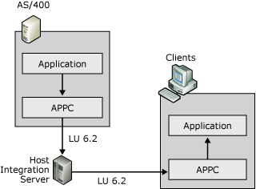

# Understanding Peer-to-Peer Networking
Devices in peer-oriented SNA networks participate in Advanced-Peer-to-Peer Networking (APPN). Each device, known as a type 2.1 physical unit (PU 2.1), handles all network routing functions, as well as normal computing activities and applications.  
  
 LU 6.2 logical units are associated with PU 2.1 devices. Devices in an APPN network appear as LU 6.2 (also called APPC LU) entities. Programs that are executed on these devices are called transaction programs(TPs).  
  
   
Diagram of peer-oriented SNA network  
  
 APPC enables TPs on different APPN systems to communicate directly with each other across an APPN network. In APPN networks, Host Integration Server provides support for the APPC protocol and emulates a PU 2.1 low-entry networking (LEN) node.  
  
 In the AS/400 environment, APPC is used for a variety of applications, including:  
  
- 5250 access  
  
- TN5250 access  
  
- File transfer  
  
  TPs use LU 6.2 names to access other systems and other transaction programs as shown inthe following figure. With Host Integration Server, a transaction program, such as a 5250 terminal emulator, can also use an APPC LU alias to access another TP. In this case, the LU alias maps to an LU name that is actually used to access the other system's TP.  
  
    
  Diagram of transaction programs in APPC  
  
  APPC uses pairs of LUs to facilitate simultaneous, bi-directional communication between transaction programs. To achieve this, a local LU and a remote LU are defined on each device in the APPN network.  
  
  The perception of local and remote LUs is dependent on the system that you are configuring. When configuring Host Integration Server, the local APPC LU corresponds to the Host Integration Server computer and the remote LU corresponds to the AS/400. Local LUs on one system communicate with remote LUs on another system. If you view the configuration from the AS/400 perspective, the Host Integration Server computer is the remote system and the AS/400 is the local system.  
  
    
  Diagram of conversation components in APPC  
  
  When a client/server network TP, such as a 5250 terminal emulator, requests a conversation with a TP on the AS/400 (remote system), the server (local system) acts on behalf of the client request and negotiates an LU 6.2 - LU 6.2 session to the AS/400. The data sent or received from the AS/400 TP is handled by the server and sent to the client TP over the selected client/server protocol. This is illustrated in the preceding figure.  
  
## See Also  
 [Understanding CPI-C](../core/understanding-cpi-c2.md)   
 [Planning APPC Connectivity](../core/planning-appc-connectivity2.md)