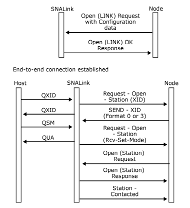

# X.25, 802.2, or Switched SDLC Line (XIDs Exchanged)
The initial sequence for a host connection over X.25, 802.2, or a switched synchronous data link control (SDLC) line is similar to the sequence over a leased line. The only difference is that exchange identifications (XIDs) are exchanged before the host (or front-end processor) sends a mode-setting command such as set mode (QSM) on an X.25 qualified logical link controlQLLC) link.  
  
 When the SNALink receives an XID, it is passed to the local node on a [Request-Open-Station](../Topic/Request-Open-Station1.md) message (on the LINK Locality Partner Index (LPI) connection). The local node then passes the data link control (DLC) a [Send-XID](../Topic/Send-XID2.md) message (also on the LINK LPI connection) containing the XID to be sent to the host. The host typically checks the node identifier in this XID and, if it is valid, sends the mode-setting command.  
  
 The sequence is shown in the following figure: 
   
  
 For switched connections using SDLC modems, the [Open(LINK) Request](../Topic/Open\(LINK\)%20Request2.md) contains dial digits for manual or auto-dial modems. It is the responsibility of the SNALink to handle the management of these devices. For X.25 and 802.2 connections, the **Open(LINK) Request** contains the address of the remote station.  
  
 The SNALink should initiate the dialing procedure when it receives the **Open(LINK) Request**.