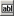

---
title: Imports Dialog Box
TOCTitle: Imports Dialog Box
ms:assetid: e4b631b1-de82-4ff2-aff9-9cc88e6ac652
ms:mtpsurl: https://msdn.microsoft.com/library/Aa561606(v=BTS.80)
ms:contentKeyID: 51533007
ms.date: 08/30/2017
mtps_version: v=BTS.80
f1_keywords:
- bts10.editor.imports
---

# Imports Dialog Box

 

Use the **Imports** dialog box to add XSD **import**, **include**, or **redefine** directives to your schema, enabling it to use and redefine schema definitions from another XSD schema.

<table>
<thead>
<tr class="header">
<th>Use this</th>
<th>To do this</th>
</tr>
</thead>
<tbody>
<tr class="odd">
<td><strong>Import new schema as</strong></td>
<td>Select the type of multischema XSD operation you want to perform: import, include, or redefine.</td>
</tr>
<tr class="even">
<td><strong>Add</strong></td>
<td>Open the <strong>BizTalk Type Picker</strong> dialog box so that you can select the schema to import, include, or redefine.</td>
</tr>
<tr class="odd">
<td><strong>Delete schema button</strong> 
 
 </td>
<td>Remove a previously imported, included, or redefined schema. 
 
This button is unavailable for any automatically imported schemas, such as XMLSchema from w3.org.</td>
</tr>
<tr class="even">
<td><strong>Edit namespace prefix button</strong> 
 
 </td>
<td>Edit (in place) the automatically generated namespace prefix associated with any schema that you have imported, included, or redefined. 
 
You can also edit the prefix by double-clicking the prefix entry.</td>
</tr>
<tr class="odd">
<td><strong>Prefix</strong> column</td>
<td>Show the prefix associated with the corresponding namespace. For schemas that you import, include, or redefine, you can edit this prefix as described for .</td>
</tr>
<tr class="even">
<td><strong>Namespace</strong> column</td>
<td>Show the namespace URI associated with the corresponding schema.</td>
</tr>
<tr class="odd">
<td><strong>Location</strong> column</td>
<td>Show the relative file location of the corresponding schema.</td>
</tr>
<tr class="even">
<td><strong>Import Type</strong> column</td>
<td>Show the type of multischema XSD operation associated with the corresponding schema for schemas that you import, include, or redefine.</td>
</tr>
</tbody>
</table>

## See Also

[Schemas That Use Other Schemas](https://msdn.microsoft.com/library/aa546766\(v=bts.80\))

